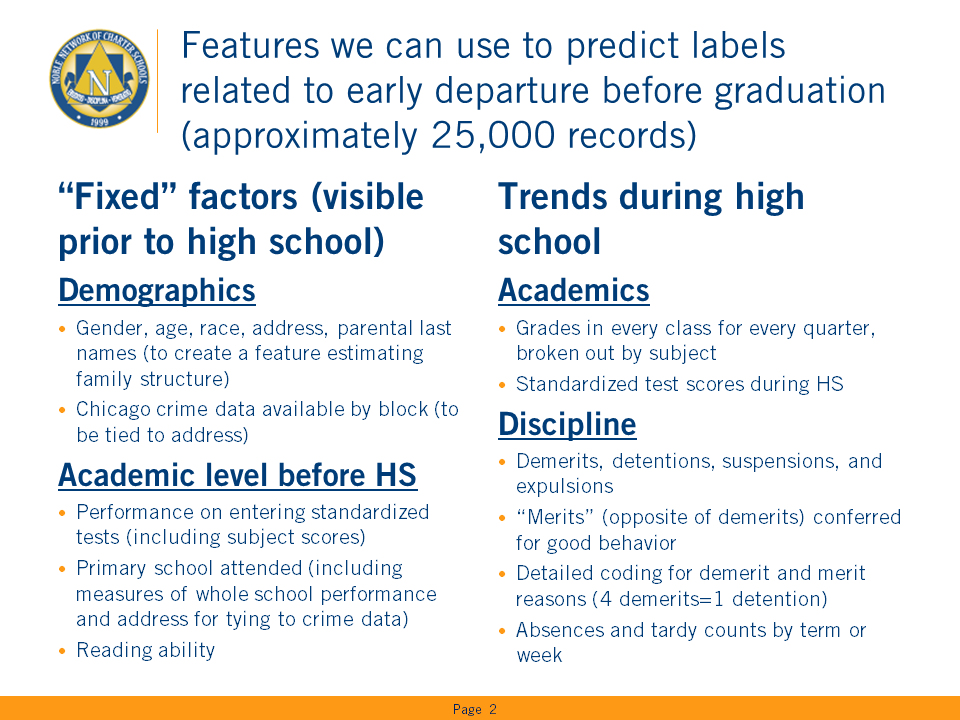

# Building a model to predict student attrition from High School

*Author*: Matt Niksch

*Synopsis*:
- Noble is a non-profit operator of 17 high schools in Chicago and serves more than 10% of public high school students in the city
- Student outcomes, including high school graduation, test score growth, GPA, college matriculation & completion are very strong
- However, although better than nearby options, too many students leave Noble and transfer to other schools. We would like to predict which students are likely to leave in order to provide them with more supports.

### Summary of potential features we might use to predict labels related to student depature:


## To start, we are going to construct features from crime data provided by the City of Chicago
This data is available for download or API access [here](https://data.cityofchicago.org/Public-Safety/Crimes-2001-to-present/ijzp-q8t2) 


```python
# The next few cells are all Python manipulations of the data if you're only interested in results,
# Skip down for the next text/markdown section
# First some library imports

import pandas as pd
import numpy as np
%matplotlib inline
import matplotlib.pyplot as plt

```


```python
# This next block takes the enormous data file and breaks it down into annual chunks that work in local memory
# It only needs to be run once.

# (The entire dataset is downloaded locally:)
crime_file = 'Crimes_-_2001_to_present.csv'

# This file is too large to read in its entirety, so we'll read in chunks one year at a time and then save as smaller files
for year in range(2001,2018):
    print('Reading {}...'.format(year),end='',flush=True)
    iter_csv = pd.read_csv(crime_file, index_col=0, iterator=True, chunksize=1000)
    cdf = pd.concat([chunk[chunk['Year'] == year] for chunk in iter_csv])
    print('saving to csv', flush=True)
    cdf.to_csv('Crimes_-_{}.csv'.format(year))
```

    Reading 2001...saving to csv
    Reading 2002...saving to csv
    Reading 2003...saving to csv
    Reading 2004...saving to csv
    Reading 2005...saving to csv
    Reading 2006...saving to csv
    Reading 2007...saving to csv
    Reading 2008...saving to csv
    Reading 2009...saving to csv
    Reading 2010...saving to csv
    Reading 2011...saving to csv
    Reading 2012...saving to csv
    Reading 2013...saving to csv
    Reading 2014...saving to csv
    Reading 2015...saving to csv
    Reading 2016...saving to csv
    Reading 2017...saving to csv
    


```python
# Now that we've made this data a little easier to work with, let's start with the 2017 data
crime_file = 'Crimes_-_2017.csv'
cdf = pd.read_csv(crime_file, index_col=0)
cdf.head()
```


<div>
<style>
    .dataframe thead tr:only-child th {
        text-align: right;
    }

    .dataframe thead th {
        text-align: left;
    }

    .dataframe tbody tr th {
        vertical-align: top;
    }
</style>
<table border="1" class="dataframe">
  <thead>
    <tr style="text-align: right;">
      <th></th>
      <th>Case Number</th>
      <th>Date</th>
      <th>Block</th>
      <th>IUCR</th>
      <th>Primary Type</th>
      <th>Description</th>
      <th>Location Description</th>
      <th>Arrest</th>
      <th>Domestic</th>
      <th>Beat</th>
      <th>...</th>
      <th>Ward</th>
      <th>Community Area</th>
      <th>FBI Code</th>
      <th>X Coordinate</th>
      <th>Y Coordinate</th>
      <th>Year</th>
      <th>Updated On</th>
      <th>Latitude</th>
      <th>Longitude</th>
      <th>Location</th>
    </tr>
    <tr>
      <th>ID</th>
      <th></th>
      <th></th>
      <th></th>
      <th></th>
      <th></th>
      <th></th>
      <th></th>
      <th></th>
      <th></th>
      <th></th>
      <th></th>
      <th></th>
      <th></th>
      <th></th>
      <th></th>
      <th></th>
      <th></th>
      <th></th>
      <th></th>
      <th></th>
      <th></th>
    </tr>
  </thead>
  <tbody>
    <tr>
      <th>10801165</th>
      <td>JA100077</td>
      <td>01/01/2017 01:00:00 AM</td>
      <td>0000X W DIVISION ST</td>
      <td>0460</td>
      <td>BATTERY</td>
      <td>SIMPLE</td>
      <td>BAR OR TAVERN</td>
      <td>True</td>
      <td>False</td>
      <td>1824</td>
      <td>...</td>
      <td>42.0</td>
      <td>8.0</td>
      <td>08B</td>
      <td>1175950.0</td>
      <td>1908370.0</td>
      <td>2017</td>
      <td>02/14/2017 03:49:42 PM</td>
      <td>41.903933</td>
      <td>-87.629129</td>
      <td>(41.903933222, -87.629128536)</td>
    </tr>
    <tr>
      <th>10801166</th>
      <td>JA100115</td>
      <td>01/01/2017 01:23:00 AM</td>
      <td>084XX S SANGAMON ST</td>
      <td>0470</td>
      <td>PUBLIC PEACE VIOLATION</td>
      <td>RECKLESS CONDUCT</td>
      <td>SIDEWALK</td>
      <td>True</td>
      <td>False</td>
      <td>613</td>
      <td>...</td>
      <td>21.0</td>
      <td>71.0</td>
      <td>24</td>
      <td>1171453.0</td>
      <td>1848804.0</td>
      <td>2017</td>
      <td>02/14/2017 03:49:42 PM</td>
      <td>41.740579</td>
      <td>-87.647394</td>
      <td>(41.740578515, -87.64739377)</td>
    </tr>
    <tr>
      <th>10801090</th>
      <td>JA100010</td>
      <td>01/01/2017 12:01:00 AM</td>
      <td>064XX S STONY ISLAND AVE</td>
      <td>1310</td>
      <td>CRIMINAL DAMAGE</td>
      <td>TO PROPERTY</td>
      <td>RESIDENCE</td>
      <td>False</td>
      <td>False</td>
      <td>314</td>
      <td>...</td>
      <td>5.0</td>
      <td>42.0</td>
      <td>14</td>
      <td>1187984.0</td>
      <td>1862596.0</td>
      <td>2017</td>
      <td>02/14/2017 03:49:42 PM</td>
      <td>41.778047</td>
      <td>-87.586388</td>
      <td>(41.778047465, -87.586387726)</td>
    </tr>
    <tr>
      <th>10801213</th>
      <td>JA100092</td>
      <td>01/01/2017 01:00:00 AM</td>
      <td>023XX S CALIFORNIA AVE</td>
      <td>0486</td>
      <td>BATTERY</td>
      <td>DOMESTIC BATTERY SIMPLE</td>
      <td>STREET</td>
      <td>False</td>
      <td>True</td>
      <td>1034</td>
      <td>...</td>
      <td>12.0</td>
      <td>30.0</td>
      <td>08B</td>
      <td>1158068.0</td>
      <td>1888177.0</td>
      <td>2017</td>
      <td>02/14/2017 03:49:42 PM</td>
      <td>41.848906</td>
      <td>-87.695365</td>
      <td>(41.848905706, -87.695364781)</td>
    </tr>
    <tr>
      <th>10801214</th>
      <td>JA100114</td>
      <td>01/01/2017 01:45:00 AM</td>
      <td>042XX N DAMEN AVE</td>
      <td>1310</td>
      <td>CRIMINAL DAMAGE</td>
      <td>TO PROPERTY</td>
      <td>RESIDENCE PORCH/HALLWAY</td>
      <td>True</td>
      <td>False</td>
      <td>1911</td>
      <td>...</td>
      <td>47.0</td>
      <td>5.0</td>
      <td>14</td>
      <td>1162249.0</td>
      <td>1928318.0</td>
      <td>2017</td>
      <td>02/14/2017 03:49:42 PM</td>
      <td>41.958969</td>
      <td>-87.678896</td>
      <td>(41.958969376, -87.678896199)</td>
    </tr>
  </tbody>
</table>
<p>5 rows × 21 columns</p>
</div>


### The above shows a sample of the data, in order to be more meaningful in our analysis, we'd like to distinguish between types of crimes

We'll likely want to build two crime indices. One based on all crimes and the other for murder and weapon/drug related ones. Those were suggested by our Director of Discipline as the most disruptive to student life, particularly because they tend to be gang related.

First, though, let's look at the general categories of data and assume these are typical for all years


```python
# One of the things we'll be interested in is the type of crime, so let's look first at the "Primary Type":
cdf['Primary Type'].value_counts()
```


    THEFT                                50469
    BATTERY                              39855
    CRIMINAL DAMAGE                      23371
    ASSAULT                              15708
    OTHER OFFENSE                        13773
    DECEPTIVE PRACTICE                   13641
    BURGLARY                             10264
    NARCOTICS                             9135
    ROBBERY                               9110
    MOTOR VEHICLE THEFT                   8989
    CRIMINAL TRESPASS                     5505
    WEAPONS VIOLATION                     3812
    OFFENSE INVOLVING CHILDREN            1737
    PUBLIC PEACE VIOLATION                1244
    CRIM SEXUAL ASSAULT                   1220
    INTERFERENCE WITH PUBLIC OFFICER       896
    SEX OFFENSE                            737
    PROSTITUTION                           620
    HOMICIDE                               561
    ARSON                                  368
    GAMBLING                               176
    LIQUOR LAW VIOLATION                   166
    STALKING                               159
    KIDNAPPING                             155
    INTIMIDATION                           117
    OBSCENITY                               57
    CONCEALED CARRY LICENSE VIOLATION       50
    NON-CRIMINAL                            26
    PUBLIC INDECENCY                         8
    HUMAN TRAFFICKING                        8
    OTHER NARCOTIC VIOLATION                 6
    NON-CRIMINAL (SUBJECT SPECIFIED)         2
    Name: Primary Type, dtype: int64


```python
# The following categories are likely entirely in the "serious" group and can be categorized as such
serious_primary = ['NARCOTICS','WEAPONS VIOLATION','HOMICIDE','OTHER NARCOTIC VIOLATION']

# Now, we'll have to do a little more work, to get to the descriptions in each primary type that fit our criteria for being
# either weapon (dangerous weapon/firearm) or drug related (assuming homicides are all captured in that major category)
for ptype in cdf['Primary Type'].unique():
    cslicedf =cdf[cdf['Primary Type'] == ptype]
    print('Value counts for {}'.format(ptype))
    print(cslicedf['Description'].value_counts())
```

    Value counts for BATTERY
    DOMESTIC BATTERY SIMPLE                                        19251
    SIMPLE                                                         13094
    AGGRAVATED: HANDGUN                                             1735
    AGGRAVATED: OTHER DANG WEAPON                                   1504
    AGGRAVATED DOMESTIC BATTERY: OTHER DANG WEAPON                   913
    AGGRAVATED:KNIFE/CUTTING INSTR                                   779
    AGGRAVATED DOMESTIC BATTERY: KNIFE/CUTTING INST                  577
    PRO EMP HANDS NO/MIN INJURY                                      505
    AGG PO HANDS NO/MIN INJURY                                       446
    AGGRAVATED DOMESTIC BATTERY: HANDS/FIST/FEET SERIOUS INJURY      362
    AGGRAVATED OF A SENIOR CITIZEN                                   180
    AGG: HANDS/FIST/FEET NO/MINOR INJURY                             122
    AGG: HANDS/FIST/FEET SERIOUS INJURY                              108
    AGGRAVATED PO: OTHER DANG WEAP                                    64
    AGGRAVATED OF A CHILD                                             62
    AGG PRO.EMP: OTHER DANG WEAPON                                    43
    AGG PRO EMP HANDS SERIOUS INJ                                     24
    AGGRAVATED: OTHER FIREARM                                         23
    AGG PO HANDS ETC SERIOUS INJ                                      23
    AGGRAVATED DOMESTIC BATTERY: HANDGUN                              11
    OF UNBORN CHILD                                                    7
    AGG PRO.EMP:KNIFE/CUTTING INST                                     7
    AGGRAVATED PO: KNIFE/CUT INSTR                                     7
    AGGRAVATED OF A UNBORN CHILD                                       5
    AGGRAVATED PO: HANDGUN                                             2
    AGGRAVATED PO: OTHER FIREARM                                       1
    Name: Description, dtype: int64
    Value counts for PUBLIC PEACE VIOLATION
    RECKLESS CONDUCT                861
    BOMB THREAT                     108
    OTHER VIOLATION                  89
    ARSON THREAT                     66
    FALSE POLICE REPORT              50
    PEEPING TOM                      37
    FALSE FIRE ALARM                 16
    PUBLIC DEMONSTRATION              8
    MOB ACTION                        5
    INTERFERE W/ EMERGENCY EQUIP      2
    SELL/ADVERTISE FIREWORKS          2
    Name: Description, dtype: int64
    Value counts for CRIMINAL DAMAGE
    TO PROPERTY                    11121
    TO VEHICLE                     10907
    CRIMINAL DEFACEMENT              738
    TO CITY OF CHICAGO PROPERTY      458
    TO STATE SUP PROP                120
    INSTITUTIONAL VANDALISM           18
    LIBRARY VANDALISM                  5
    TO FIRE FIGHT.APP.EQUIP            4
    Name: Description, dtype: int64
    Value counts for ROBBERY
    ARMED: HANDGUN                    3402
    STRONGARM - NO WEAPON             2820
    AGGRAVATED                         568
    ARMED:KNIFE/CUTTING INSTRUMENT     420
    AGGRAVATED VEHICULAR HIJACKING     394
    ARMED: OTHER DANGEROUS WEAPON      384
    ATTEMPT: STRONGARM-NO WEAPON       303
    ATTEMPT: ARMED-HANDGUN             301
    VEHICULAR HIJACKING                265
    ATTEMPT: ARMED-KNIFE/CUT INSTR      87
    ATTEMPT: AGGRAVATED                 59
    ATTEMPT: ARMED-OTHER DANG WEAP      50
    ARMED: OTHER FIREARM                46
    ATTEMPT: ARMED-OTHER FIREARM        11
    Name: Description, dtype: int64
    Value counts for THEFT
    $500 AND UNDER                 19293
    OVER $500                      12246
    RETAIL THEFT                    8179
    FROM BUILDING                   8126
    POCKET-PICKING                  1766
    PURSE-SNATCHING                  505
    ATTEMPT THEFT                    311
    DELIVERY CONTAINER THEFT          25
    FROM COIN-OP MACHINE/DEVICE       18
    Name: Description, dtype: int64
    Value counts for ASSAULT
    SIMPLE                            10367
    AGGRAVATED: HANDGUN                2339
    AGGRAVATED:KNIFE/CUTTING INSTR     1180
    AGGRAVATED: OTHER DANG WEAPON       910
    PRO EMP HANDS NO/MIN INJURY         407
    AGG PO HANDS NO/MIN INJURY          214
    AGGRAVATED: OTHER FIREARM            69
    AGGRAVATED PO: OTHER DANG WEAP       58
    AGG PRO.EMP: OTHER DANG WEAPON       38
    AGG PRO.EMP: HANDGUN                 35
    AGGRAVATED PO: HANDGUN               34
    AGG PRO.EMP:KNIFE/CUTTING INST       33
    AGGRAVATED PO:KNIFE/CUT INSTR        21
    AGGRAVATED PO: OTHER FIREARM          2
    AGG PRO.EMP: OTHER FIREARM            1
    Name: Description, dtype: int64
    Value counts for MOTOR VEHICLE THEFT
    AUTOMOBILE                                     7743
    THEFT/RECOVERY: AUTOMOBILE                      555
    ATT: AUTOMOBILE                                 391
    TRUCK, BUS, MOTOR HOME                          132
    CYCLE, SCOOTER, BIKE W-VIN                      132
    THEFT/RECOVERY: TRUCK,BUS,MHOME                  17
    CYCLE, SCOOTER, BIKE NO VIN                       8
    THEFT/RECOVERY: CYCLE, SCOOTER, BIKE W-VIN        5
    ATTEMPT: CYCLE, SCOOTER, BIKE W-VIN               4
    THEFT/RECOVERY: CYCLE, SCOOTER, BIKE NO VIN       1
    ATT: TRUCK, BUS, MOTOR HOME                       1
    Name: Description, dtype: int64
    Value counts for BURGLARY
    FORCIBLE ENTRY            5942
    UNLAWFUL ENTRY            3637
    ATTEMPT FORCIBLE ENTRY     488
    HOME INVASION              197
    Name: Description, dtype: int64
    Value counts for DECEPTIVE PRACTICE
    FINANCIAL IDENTITY THEFT OVER $ 300        3284
    CREDIT CARD FRAUD                          2915
    FRAUD OR CONFIDENCE GAME                   1332
    FINANCIAL IDENTITY THEFT $300 AND UNDER    1265
    ILLEGAL USE CASH CARD                      1049
    THEFT OF LABOR/SERVICES                     711
    COUNTERFEITING DOCUMENT                     695
    ATTEMPT - FINANCIAL IDENTITY THEFT          527
    COUNTERFEIT CHECK                           372
    FORGERY                                     363
    BOGUS CHECK                                 311
    THEFT BY LESSEE,MOTOR VEH                   254
    THEFT OF LOST/MISLAID PROP                  130
    AGGRAVATED FINANCIAL IDENTITY THEFT         102
    COMPUTER FRAUD                              102
    FINAN EXPLOIT-ELDERLY/DISABLED               50
    UNAUTHORIZED VIDEOTAPING                     37
    STOLEN PROP: BUY/RECEIVE/POS.                32
    ILLEGAL POSSESSION CASH CARD                 20
    UNLAWFUL USE OF A COMPUTER                   19
    EMBEZZLEMENT                                 16
    DECEPTIVE COLLECTION PRACTICES               12
    PAY TV SERVICE OFFENSES                      11
    UNLAWFUL USE OF RECORDED SOUND                9
    THEFT BY LESSEE,NON-VEH                       9
    IMPERSONATION                                 9
    AGGRAVATED COMPUTER TAMPERING                 4
    ALTER COINS                                   1
    Name: Description, dtype: int64
    Value counts for HOMICIDE
    FIRST DEGREE MURDER    560
    RECKLESS HOMICIDE        1
    Name: Description, dtype: int64
    Value counts for ARSON
    BY FIRE                          279
    AGGRAVATED                        42
    ATTEMPT ARSON                     41
    POS: EXPLOSIVE/INCENDIARY DEV      3
    BY EXPLOSIVE                       3
    Name: Description, dtype: int64
    Value counts for OTHER OFFENSE
    TELEPHONE THREAT                                      3138
    HARASSMENT BY TELEPHONE                               2217
    HARASSMENT BY ELECTRONIC MEANS                        2139
    VIOLATE ORDER OF PROTECTION                           1269
    OTHER VEHICLE OFFENSE                                 1155
    FALSE/STOLEN/ALTERED TRP                               673
    PAROLE VIOLATION                                       624
    VEHICLE TITLE/REG OFFENSE                              490
    LICENSE VIOLATION                                      388
    OTHER CRIME AGAINST PERSON                             313
    GUN OFFENDER: ANNUAL REGISTRATION                      213
    OTHER CRIME INVOLVING PROPERTY                         185
    SEX OFFENDER: FAIL TO REGISTER                         168
    GUN OFFENDER: DUTY TO REGISTER                         141
    SEX OFFENDER: FAIL REG NEW ADD                         133
    OTHER WEAPONS VIOLATION                                124
    ANIMAL ABUSE/NEGLECT                                   108
    VIOLATION OF CIVIL NO CONTACT ORDER                     57
    VIOLENT OFFENDER: ANNUAL REGISTRATION                   41
    VIOLENT OFFENDER: DUTY TO REGISTER                      32
    PROBATION VIOLATION                                     28
    GUN OFFENDER: DUTY TO REPORT CHANGE OF INFORMATION      23
    VIO BAIL BOND: DOM VIOLENCE                             17
    TAMPER WITH MOTOR VEHICLE                               16
    OBSCENE TELEPHONE CALLS                                 15
    BOARD PLANE WITH WEAPON                                 13
    VIOLENT OFFENDER: FAIL TO REGISTER NEW ADDRESS           9
    VIOLATION GPS MONITORING DEVICE                          8
    POSSESSION OF BURGLARY TOOLS                             5
    ARSONIST: ANNUAL REGISTRATION                            5
    VIOLATION OF SMOKING BAN                                 4
    EAVESDROPPING                                            4
    ABUSE/NEGLECT: CARE FACILITY                             4
    SEX OFFENDER: PROHIBITED ZONE                            3
    HAZARDOUS MATERIALS VIOLATION                            3
    ARSONIST: FAIL TO REGISTER NEW ADDRESS                   2
    OTHER ARSON/EXPLOSIVE INCIDENT                           2
    ARSONIST: DUTY TO REGISTER                               1
    MONEY LAUNDERING                                         1
    INTERFERE W/ HIGHER EDUCATION                            1
    ANIMAL FIGHTING                                          1
    Name: Description, dtype: int64
    Value counts for NARCOTICS
    POSS: HEROIN(WHITE)                                    1780
    POSS: CANNABIS 30GMS OR LESS                            980
    MANU/DELIVER: HEROIN (WHITE)                            869
    POSS: CRACK                                             867
    FOUND SUSPECT NARCOTICS                                 764
    POSS: CANNABIS MORE THAN 30GMS                          532
    MANU/DEL:CANNABIS 10GM OR LESS                          528
    MANU/DEL:CANNABIS OVER 10 GMS                           485
    POSS: COCAINE                                           413
    MANU/DELIVER:CRACK                                      390
    SOLICIT NARCOTICS ON PUBLICWAY                          291
    POSS: SYNTHETIC DRUGS                                   223
    POSS: BARBITUATES                                       149
    POSS: PCP                                               143
    POSSESSION OF DRUG EQUIPMENT                             91
    POSS: HALLUCINOGENS                                      81
    POSS: HEROIN(BRN/TAN)                                    78
    FORFEIT PROPERTY                                         64
    MANU/DELIVER:COCAINE                                     62
    ALTER/FORGE PRESCRIPTION                                 55
    MANU/DELIVER:PCP                                         49
    POSS: METHAMPHETAMINES                                   47
    ATTEMPT POSSESSION NARCOTICS                             33
    MANU/DELIVER:SYNTHETIC DRUGS                             22
    POSS: AMPHETAMINES                                       22
    MANU/DELIVER: HEROIN(BRN/TAN)                            19
    CRIMINAL DRUG CONSPIRACY                                 13
    POSSESSION: SYNTHETIC MARIJUANA                          13
    MANU/DELIVER:BARBITUATES                                 13
    MANU/DELIVER: HALLUCINOGEN                               10
    MANU/DELIVER: METHAMPHETAMINES                            9
    POSS: HEROIN(BLACK TAR)                                   9
    POS: HYPODERMIC NEEDLE                                    7
    MANU/POSS. W/INTENT TO DELIVER: SYNTHETIC MARIJUANA       5
    POSS: LOOK-ALIKE DRUGS                                    4
    DELIVER CANNABIS TO PERSON <18                            4
    SALE/DEL DRUG PARAPHERNALIA                               3
    CANNABIS PLANT                                            3
    MANU/DELIVER:AMPHETAMINES                                 2
    DEL CONT SUBS TO PERSON <18                               2
    MANU/DELIVER:HEROIN(BLACK TAR)                            1
    Name: Description, dtype: int64
    Value counts for WEAPONS VIOLATION
    UNLAWFUL POSS OF HANDGUN          2939
    UNLAWFUL USE HANDGUN               263
    RECKLESS FIREARM DISCHARGE         234
    UNLAWFUL POSS AMMUNITION            86
    UNLAWFUL POSS OTHER FIREARM         85
    UNLAWFUL USE OTHER DANG WEAPON      78
    POSS FIREARM/AMMO:NO FOID CARD      58
    UNLAWFUL USE/SALE AIR RIFLE         33
    UNLAWFUL USE OTHER FIREARM          28
    UNLAWFUL SALE HANDGUN                6
    DEFACE IDENT MARKS OF FIREARM        1
    USE OF METAL PIERCING BULLETS        1
    Name: Description, dtype: int64
    Value counts for CRIMINAL TRESPASS
    TO LAND              3117
    TO RESIDENCE         1121
    TO VEHICLE            790
    TO STATE SUP LAND     473
    TO AIRPORT              4
    Name: Description, dtype: int64
    Value counts for CRIM SEXUAL ASSAULT
    NON-AGGRAVATED                   843
    AGGRAVATED: OTHER                145
    PREDATORY                         71
    ATTEMPT NON-AGGRAVATED            53
    AGGRAVATED: HANDGUN               52
    AGGRAVATED: KNIFE/CUT INSTR       24
    AGGRAVATED: OTHER DANG WEAPON     17
    ATTEMPT AGG: OTHER                 9
    ATTEMPT AGG: HANDGUN               5
    ATTEMPT AGG: KNIFE/CUT INSTR       1
    Name: Description, dtype: int64
    Value counts for STALKING
    SIMPLE                                    129
    CYBERSTALKING                              17
    VIOLATION OF STALKING NO CONTACT ORDER     11
    AGGRAVATED                                  2
    Name: Description, dtype: int64
    Value counts for OFFENSE INVOLVING CHILDREN
    CHILD ABUSE                             545
    OTHER OFFENSE                           330
    ENDANGERING LIFE/HEALTH CHILD           260
    AGG CRIM SEX ABUSE FAM MEMBER           118
    CRIM SEX ABUSE BY FAM MEMBER            117
    CHILD ABDUCTION                          81
    CHILD PORNOGRAPHY                        77
    SEX ASSLT OF CHILD BY FAM MBR            68
    AGG SEX ASSLT OF CHILD FAM MBR           68
    CHILD ABANDONMENT                        39
    CONTRIBUTE CRIM DELINQUENCY JUVENILE     13
    CONTRIBUTE DELINQUENCY OF A CHILD        12
    POS: PORNOGRAPHIC PRINT                   6
    HARBOR RUNAWAY                            2
    SALE TOBACCO PRODUCTS TO MINOR            1
    Name: Description, dtype: int64
    Value counts for CONCEALED CARRY LICENSE VIOLATION
    PROHIBITED PLACES                  25
    OTHER                              13
    ARMED WHILE UNDER THE INFLUENCE    12
    Name: Description, dtype: int64
    Value counts for INTIMIDATION
    INTIMIDATION                                66
    EXTORTION                                   50
    INTIMIDATION OF LAW ENFORCEMENT OFFICIAL     1
    Name: Description, dtype: int64
    Value counts for KIDNAPPING
    CHILD ABDUCTION/STRANGER         57
    UNLAWFUL INTERFERE/VISITATION    40
    UNLAWFUL RESTRAINT               29
    KIDNAPPING                       20
    AGGRAVATED                        6
    FORCIBLE DETENTION                3
    Name: Description, dtype: int64
    Value counts for PROSTITUTION
    SOLICIT ON PUBLIC WAY         527
    SOLICIT FOR BUSINESS           37
    CALL OPERATION                 29
    SOLICIT FOR PROSTITUTE         17
    OTHER PROSTITUTION OFFENSE      4
    KEEP PLACE OF PROSTITUTION      2
    SOLICIT OFF PUBLIC WAY          2
    CAB OPERATION                   1
    PANDERING                       1
    Name: Description, dtype: int64
    Value counts for INTERFERENCE WITH PUBLIC OFFICER
    OBSTRUCTING IDENTIFICATION        536
    RESIST/OBSTRUCT/DISARM OFFICER    264
    OBSTRUCTING JUSTICE                49
    OBSTRUCTING SERVICE                18
    INTERFERENCE JUDICIAL PROCESS      17
    ESCAPE                              8
    BRIBERY                             3
    OFFICIAL MISCONDUCT                 1
    Name: Description, dtype: int64
    Value counts for SEX OFFENSE
    CRIMINAL SEXUAL ABUSE             297
    PUBLIC INDECENCY                  164
    AGG CRIMINAL SEXUAL ABUSE         124
    SEXUAL EXPLOITATION OF A CHILD     39
    OTHER                              36
    ATT CRIM SEXUAL ABUSE              29
    INDECENT SOLICITATION/CHILD        21
    ATT AGG CRIMINAL SEXUAL ABUSE      11
    CRIMINAL TRANSMISSION OF HIV        6
    INDECENT SOLICITATION/ADULT         5
    SEX RELATION IN FAMILY              5
    Name: Description, dtype: int64
    Value counts for LIQUOR LAW VIOLATION
    LIQUOR LICENSE VIOLATION         84
    SELL/GIVE/DEL LIQUOR TO MINOR    41
    ILLEGAL POSSESSION BY MINOR      27
    ILLEGAL CONSUMPTION BY MINOR     13
    MINOR MISREPRESENT AGE            1
    Name: Description, dtype: int64
    Value counts for NON-CRIMINAL
    LOST PASSPORT                           18
    FOID - REVOCATION                        6
    GUN OFFENDER NOTIFICATION-NO CONTACT     1
    FOUND PASSPORT                           1
    Name: Description, dtype: int64
    Value counts for PUBLIC INDECENCY
    LICENSED PREMISE    8
    Name: Description, dtype: int64
    Value counts for GAMBLING
    GAME/DICE                166
    GAME/CARDS                 5
    OTHER                      4
    GAME/AMUSEMENT DEVICE      1
    Name: Description, dtype: int64
    Value counts for OBSCENITY
    OBSCENE MATTER                    33
    SALE/DIST OBSCENE MAT TO MINOR    13
    OBSCENITY                         11
    Name: Description, dtype: int64
    Value counts for NON-CRIMINAL (SUBJECT SPECIFIED)
    NOTIFICATION OF CIVIL NO CONTACT ORDER    2
    Name: Description, dtype: int64
    Value counts for HUMAN TRAFFICKING
    COMMERCIAL SEX ACTS      6
    INVOLUNTARY SERVITUDE    2
    Name: Description, dtype: int64
    Value counts for OTHER NARCOTIC VIOLATION
    INTOXICATING COMPOUNDS    6
    Name: Description, dtype: int64
    


```python
# Based on the above list (and assuming its comprehensive), we'll build out a list of other "serious" offenses by inspection
serious_other = {
    'BATTERY':['AGGRAVATED: HANDGUN',
               'AGGRAVATED: OTHER DANG WEAPON',
               'AGGRAVATED DOMESTIC BATTERY: OTHER DANG WEAPON',
               'AGGRAVATED PO: OTHER DANG WEAP',
               'AGGRAVATED: OTHER FIREARM',
               'AGGRAVATED DOMESTIC BATTERY: HANDGUN',
               'AGGRAVATED PO: HANDGUN',
               'AGGRAVATED PO: OTHER FIREARM',
              ],
    'ROBBERY':['ARMED: HANDGUN',
               'ARMED: OTHER DANGEROUS WEAPON',
               'ATTEMPT: ARMED-HANDGUN',
               'ATTEMPT: ARMED-OTHER DANG WEAP',
               'ARMED: OTHER FIREARM',
               'ATTEMPT: ARMED-OTHER FIREARM',
              ],
    'ASSAULT':['AGGRAVATED: HANDGUN',
               'AGGRAVATED: OTHER DANG WEAPON',
               'AGGRAVATED: OTHER FIREARM',
               'AGGRAVATED PO: OTHER DANG WEAP',
               'AGG PRO.EMP: OTHER DANG WEAPON',
               'AGG PRO.EMP: HANDGUN',
               'AGGRAVATED PO: HANDGUN',
               'AGGRAVATED PO: OTHER FIREARM',
               'AGG PRO.EMP: OTHER FIREARM',
              ],
    'CRIM SEXUAL ASSAULT':['AGGRAVATED: HANDGUN',
                           'AGGRAVATED: OTHER DANG WEAPON',
                           'ATTEMPT AGG: HANDGUN',
                          ],
}
```


```python
# With these combined, we can add a field to the crime database indicating "serious" or not
def determine_serious_crime(x, prime_list, other_dict):
    '''Apply function to determine if crime is "serious" or not. Will be passed the primary type and description of a crime'''
    primary, description = x
    if primary in prime_list:
        return 1
    elif primary in other_dict:
        if description in other_dict[primary]:
            return 1
    return 0
```


```python
print('Total crime in df: {}'.format(len(cdf)))
cdf['serious'] = cdf[['Primary Type', 'Description']].apply(determine_serious_crime, axis=1,
                                                            args=(serious_primary,serious_other,))
print('Serious crime in df: {}'.format(len(cdf[cdf['serious']==1])))
```

    Total crime in df: 211945
    Serious crime in df: 25521
    

# To summarize the above:

We've constructed a reference of the types of crimes we suspect might be most harmful to children growing up in their vicinity.

Based on this sample of data (2017 YTD), slightly more than 10% (12% in this case) of the crime in the city is "serious"

## Next, we'll work to geocode the data uniformly

While there exists geocoding for all of the 2017 data above, it unfortunately didn't start in the data serious until 2016. We'll next work to build a database of uniform geocodes by block


```python
blocks = cdf.Block.unique()
print('There are a total of {} blocks in this data sample'.format(len(blocks)))
```

    There are a total of 26568 blocks in this data sample
    


```python
# Let's look at a specific block:

near_df = cdf[cdf['Block']=='042XX N DAMEN AVE']
print(near_df)
```

             Case Number                    Date              Block  IUCR  \
    ID                                                                      
    10801214    JA100114  01/01/2017 01:45:00 AM  042XX N DAMEN AVE  1310   
    10965787    JA287219  05/31/2017 07:50:00 AM  042XX N DAMEN AVE  0610   
    11042088    JA376641  08/03/2017 01:00:00 PM  042XX N DAMEN AVE  1153   
    
                    Primary Type                          Description  \
    ID                                                                  
    10801214     CRIMINAL DAMAGE                          TO PROPERTY   
    10965787            BURGLARY                       FORCIBLE ENTRY   
    11042088  DECEPTIVE PRACTICE  FINANCIAL IDENTITY THEFT OVER $ 300   
    
                 Location Description  Arrest  Domestic  Beat   ...     \
    ID                                                          ...      
    10801214  RESIDENCE PORCH/HALLWAY    True     False  1911   ...      
    10965787                APARTMENT   False     False  1911   ...      
    11042088                    OTHER   False     False  1911   ...      
    
              Community Area  FBI Code  X Coordinate Y Coordinate  Year  \
    ID                                                                    
    10801214             5.0        14     1162249.0    1928318.0  2017   
    10965787             5.0        05     1162247.0    1928358.0  2017   
    11042088             5.0        11     1162256.0    1928095.0  2017   
    
                          Updated On   Latitude  Longitude  \
    ID                                                       
    10801214  02/14/2017 03:49:42 PM  41.958969 -87.678896   
    10965787  06/07/2017 03:51:50 PM  41.959079 -87.678902   
    11042088  08/10/2017 03:56:38 PM  41.958357 -87.678877   
    
                                   Location  serious  
    ID                                                
    10801214  (41.958969376, -87.678896199)        0  
    10965787   (41.95907918, -87.678902428)        0  
    11042088  (41.958357306, -87.678876725)        0  
    
    [3 rows x 22 columns]
    

## You can note that the latitudes and longitudes are similar

This [source](https://gis.stackexchange.com/questions/8650/measuring-accuracy-of-latitude-and-longitude/8674#8674) gives a good overview of the precision of latitude and longitude decimal places. The 3rd decimal provides about 100m of precision.

For this data, we'll average the lat/lon locations and then round to 3 digits to create a uniform location per block. If there are blocks in the older data sets that don't have lat/lon information (e.g. because there was no crime in 2016/2017), then we'll attempt to use public libraries to first geocode a median block location (042XX will become 04250) and then average to 3 decimals.


```python
rounded_lat_lon = cdf[['Block', 'Latitude', 'Longitude']].groupby(['Block']).mean().round(3)
print(rounded_lat_lon.head(10))
```

                      Latitude  Longitude
    Block                                
    0000X E 100TH PL    41.712    -87.622
    0000X E 100TH ST    41.713    -87.622
    0000X E 101ST PL    41.710    -87.622
    0000X E 101ST ST    41.711    -87.622
    0000X E 102ND PL    41.708    -87.622
    0000X E 102ND ST    41.709    -87.622
    0000X E 103RD PL    41.706    -87.622
    0000X E 103RD ST    41.706    -87.622
    0000X E 104TH ST    41.705    -87.622
    0000X E 105TH ST    41.703    -87.622
    

## Looking at the above, which happen to be parallel East-West streets

It seems that the approach of rounding to the 3rd decimal produces consistent results.

We can then combine this lat/long info with the crime counts to create a full source table for looking at students (for 2017)


```python
serious_crime_count = cdf[['Block', 'serious']].groupby(['Block']).sum() 
all_crime_count = cdf[['Block', 'serious']].groupby(['Block']).count() #this will have a 'serious' header we need to change
all_crime_count.rename(columns={'serious':'all_crimes'}, inplace=True)
block_crime_data = pd.concat([all_crime_count, serious_crime_count, rounded_lat_lon], axis=1)
print(block_crime_data.head(10))
```

                      all_crimes  serious  Latitude  Longitude
    Block                                                     
    0000X E 100TH PL          23        5    41.712    -87.622
    0000X E 100TH ST          21        3    41.713    -87.622
    0000X E 101ST PL          11        5    41.710    -87.622
    0000X E 101ST ST           3        0    41.711    -87.622
    0000X E 102ND PL          21       10    41.708    -87.622
    0000X E 102ND ST          16        5    41.709    -87.622
    0000X E 103RD PL           8        2    41.706    -87.622
    0000X E 103RD ST          40        6    41.706    -87.622
    0000X E 104TH ST          11        6    41.705    -87.622
    0000X E 105TH ST           4        0    41.703    -87.622
    

# Great!

We now have a table of crime and serious crime by block. The next step will be to tie it to a specific location.

To do this, we can create a function that returns all of the crime within a rectangular range around a given lat/long.


```python
# Let's start with the address of a randomly selected student
block_crime_data.loc['009XX N MENARD AVE']
```


    all_crimes     3.000
    serious        1.000
    Latitude      41.898
    Longitude    -87.770
    Name: 009XX N MENARD AVE, dtype: float64


```python
def give_radius_crime(df,lat,lon,plusminus):
    '''Returns a tuple of (all_crime, serious_crime) around the provided lat/long plus or minus the final field'''
    df_local = df[((lat-plusminus) <= df['Latitude']) &
                  ((lat+plusminus) >= df['Latitude']) &
                  ((lon-plusminus) <= df['Longitude']) &
                  ((lon+plusminus) >= df['Longitude'])]
    print(df_local)
    serious = df_local['serious'].sum()
    all_crime = df_local['all_crimes'].sum()
    return (all_crime, serious)
```


```python
block_label = '009XX N MENARD AVE'
this_block = block_crime_data.loc[block_label]
for sensitivity in [0.001, 0.0015, 0.002]:
    print('Crime count for sensitivity of {}'.format(sensitivity))
    this_block_crimes = give_radius_crime(block_crime_data, this_block['Latitude'],
                                         this_block['Longitude'], sensitivity)
    print('Total of {} instances of crime for {}, {} of which were serious'.format(this_block_crimes[0],
                                                                              block_label,
                                                                              this_block_crimes[1]))
```

    Crime count for sensitivity of 0.001
                           all_crimes  serious  Latitude  Longitude
    Block                                                          
    009XX N MASSASOIT AVE          10        4    41.898    -87.769
    009XX N MENARD AVE              3        1    41.898    -87.770
    010XX N MASSASOIT AVE          28        6    41.899    -87.769
    010XX N MENARD AVE             11        1    41.899    -87.770
    057XX W AUGUSTA BLVD            5        2    41.898    -87.769
    Total of 57 instances of crime for 009XX N MENARD AVE, 14 of which were serious
    Crime count for sensitivity of 0.0015
                           all_crimes  serious  Latitude  Longitude
    Block                                                          
    009XX N MASSASOIT AVE          10        4    41.898    -87.769
    009XX N MENARD AVE              3        1    41.898    -87.770
    010XX N MASSASOIT AVE          28        6    41.899    -87.769
    010XX N MENARD AVE             11        1    41.899    -87.770
    057XX W AUGUSTA BLVD            5        2    41.898    -87.769
    057XX W IOWA ST                 5        0    41.897    -87.769
    058XX W IOWA ST                11        3    41.897    -87.771
    058XX W WALTON ST               7        1    41.897    -87.771
    Total of 80 instances of crime for 009XX N MENARD AVE, 18 of which were serious
    Crime count for sensitivity of 0.002
                           all_crimes  serious  Latitude  Longitude
    Block                                                          
    008XX N MASSASOIT AVE          26        3    41.896    -87.769
    008XX N WALLER AVE             17        6    41.896    -87.768
    009XX N MASSASOIT AVE          10        4    41.898    -87.769
    009XX N MENARD AVE              3        1    41.898    -87.770
    009XX N WALLER AVE             16        1    41.897    -87.768
    010XX N MASSASOIT AVE          28        6    41.899    -87.769
    010XX N MENARD AVE             11        1    41.899    -87.770
    010XX N WALLER AVE              9        5    41.899    -87.768
    057XX W AUGUSTA BLVD            5        2    41.898    -87.769
    057XX W IOWA ST                 5        0    41.897    -87.769
    057XX W THOMAS ST              13        0    41.900    -87.769
    058XX W IOWA ST                11        3    41.897    -87.771
    058XX W RICE ST                14        0    41.896    -87.771
    058XX W WALTON ST               7        1    41.897    -87.771
    Total of 175 instances of crime for 009XX N MENARD AVE, 33 of which were serious
    

For reference, here's the block in question (yellow, blue, and purple markers denote the inner, middle, and outer sensitivities):

