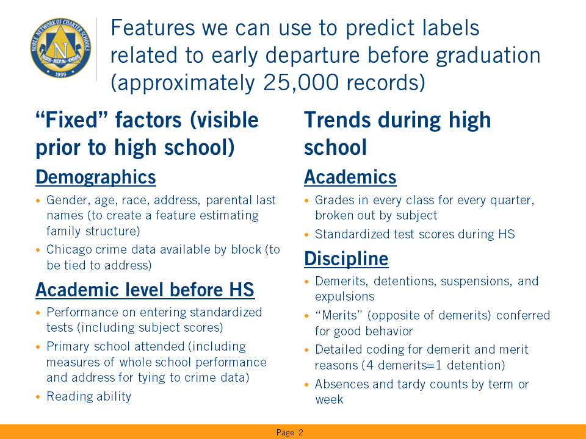
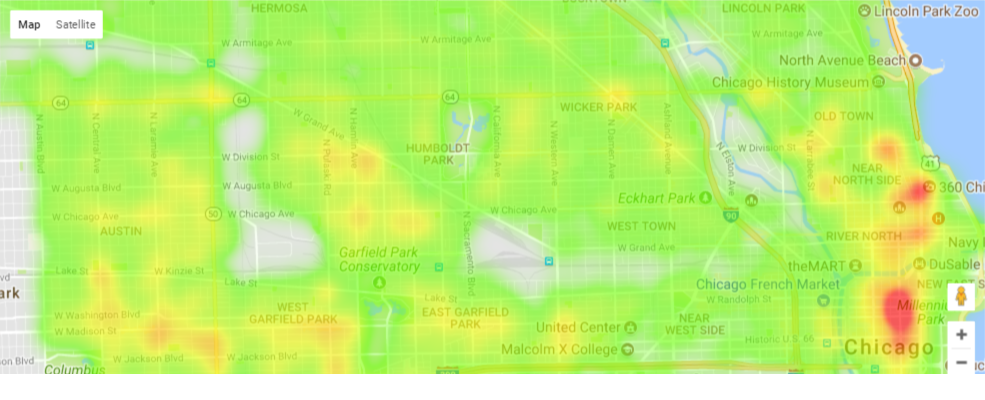
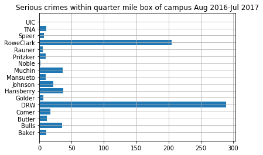
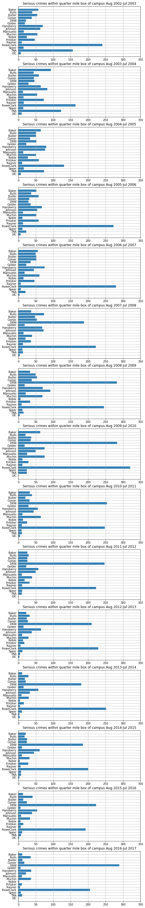

# Building a model to predict student attrition from High School

*Author*: Matt Niksch

*Synopsis*:
- Noble is a non-profit operator of 17 high schools in Chicago and serves more than 10% of public high school students in the city
- Student outcomes, including high school graduation, test score growth, GPA, college matriculation & completion are very strong
- However, although better than nearby options, too many students leave Noble and transfer to other schools. We would like to predict which students are likely to leave in order to provide them with more supports.

### Summary of potential features we might use to predict labels related to student depature:


## Calculating crime statistics for students

In this file, we'll be working with the concepts from the prior file to create a condensed database of crimes that has a row per block per year, where year is chosen to start on a specific month and then include the following 11 months. (This will allow for us to look at a full year prior to the start of the school year


```python
# First some library imports

import pandas as pd
import numpy as np
%matplotlib inline
import matplotlib.pyplot as plt
#import googlemaps
#gmaps = googlemaps.Client(key='your key here')
```


```python
import gmaps
import gmaps.datasets
gmaps.configure(api_key="your key here") # Your Google API key
```


```python
# In the last notebook, we built out the geocodes for all crimes
crime_ll = pd.read_csv('full_lat_lon_blocks.csv')
```


```python
crime_ll.head()
```


<div>
<style>
    .dataframe thead tr:only-child th {
        text-align: right;
    }

    .dataframe thead th {
        text-align: left;
    }

    .dataframe tbody tr th {
        vertical-align: top;
    }
</style>
<table border="1" class="dataframe">
  <thead>
    <tr style="text-align: right;">
      <th></th>
      <th>Block</th>
      <th>Latitude</th>
      <th>Longitude</th>
      <th>N</th>
    </tr>
  </thead>
  <tbody>
    <tr>
      <th>0</th>
      <td>0000X E 100 PL</td>
      <td>41.712</td>
      <td>-87.622</td>
      <td>44</td>
    </tr>
    <tr>
      <th>1</th>
      <td>0000X E 100 ST</td>
      <td>41.713</td>
      <td>-87.622</td>
      <td>44</td>
    </tr>
    <tr>
      <th>2</th>
      <td>0000X E 100TH PL</td>
      <td>41.712</td>
      <td>-87.622</td>
      <td>495</td>
    </tr>
    <tr>
      <th>3</th>
      <td>0000X E 100TH ST</td>
      <td>41.713</td>
      <td>-87.622</td>
      <td>392</td>
    </tr>
    <tr>
      <th>4</th>
      <td>0000X E 101 PL</td>
      <td>41.710</td>
      <td>-87.622</td>
      <td>10</td>
    </tr>
  </tbody>
</table>
</div>


```python
crime_ll['ll_present']=~np.isnan(crime_ll['Latitude']) # Remove the small # of entries with no lat/long
clean_ll = crime_ll[crime_ll['ll_present']]
locations = clean_ll[['Latitude','Longitude']]
weights = clean_ll['N']
fig = gmaps.figure()
fig.add_layer(gmaps.heatmap_layer(locations, weights=weights, point_radius=30))
fig
```





```python
# We'll come back to plotting crime later, but first we want to use the geocodes to develop a table of crime by block for
# a range of time across up to two calendar years; we'll begin by redefining "serious" crimes (see wb-a for details):
serious_primary = ['NARCOTICS','WEAPONS VIOLATION','HOMICIDE','OTHER NARCOTIC VIOLATION']
serious_other = {
    'BATTERY':['AGGRAVATED: HANDGUN',
               'AGGRAVATED: OTHER DANG WEAPON',
               'AGGRAVATED DOMESTIC BATTERY: OTHER DANG WEAPON',
               'AGGRAVATED PO: OTHER DANG WEAP',
               'AGGRAVATED: OTHER FIREARM',
               'AGGRAVATED DOMESTIC BATTERY: HANDGUN',
               'AGGRAVATED PO: HANDGUN',
               'AGGRAVATED PO: OTHER FIREARM',
              ],
    'ROBBERY':['ARMED: HANDGUN',
               'ARMED: OTHER DANGEROUS WEAPON',
               'ATTEMPT: ARMED-HANDGUN',
               'ATTEMPT: ARMED-OTHER DANG WEAP',
               'ARMED: OTHER FIREARM',
               'ATTEMPT: ARMED-OTHER FIREARM',
              ],
    'ASSAULT':['AGGRAVATED: HANDGUN',
               'AGGRAVATED: OTHER DANG WEAPON',
               'AGGRAVATED: OTHER FIREARM',
               'AGGRAVATED PO: OTHER DANG WEAP',
               'AGG PRO.EMP: OTHER DANG WEAPON',
               'AGG PRO.EMP: HANDGUN',
               'AGGRAVATED PO: HANDGUN',
               'AGGRAVATED PO: OTHER FIREARM',
               'AGG PRO.EMP: OTHER FIREARM',
              ],
    'CRIM SEXUAL ASSAULT':['AGGRAVATED: HANDGUN',
                           'AGGRAVATED: OTHER DANG WEAPON',
                           'ATTEMPT AGG: HANDGUN',
                          ],
}

```


```python
# With these combined, we can add a field to the crime database indicating "serious" or not
def determine_serious_crime(x, prime_list, other_dict):
    '''Apply function to determine if crime is "serious" or not. Will be passed the primary type and description of a crime'''
    primary, description = x
    if primary in prime_list:
        return 1
    elif primary in other_dict:
        if description in other_dict[primary]:
            return 1
    return 0
```


```python
# Here's a clean dictiionary of lat/long to substitute for what's in the crime data
ll_dict = {r['Block']:(r['Latitude'],r['Longitude']) for i,r in clean_ll.iterrows()}
```


```python
def get_month(x):
    '''Apply function that extracts the month of a crime from the text datestring'''
    return int(x[:2]) # relies on the fact that datestrings always start mm/dd/yyyy

def apply_new_ll(x, i):
    '''Apply function to lookup lat/long from ll_dict'''
    if x in ll_dict:
        return ll_dict[x][i]
    else:
        return np.nan
    
def build_crime_db(label, *args):
    '''After label argument, function takes any number of tuples with the following structure:
    0=filename
    1=start_month
    2=end_month
    and then builds a crime count by block, returning the following dataframe:
    index=Block
    all_crimes (count), serious_crimes (count), Latitude, Longitude, label
    Assumes that the variables ll_dict and determine_serious_crime (which requires serious_primary and serious_other) are
    available'''
    first_pass = True # to determine if we should concatenate or not
    for filename, start_month, end_month in args:
        cdf = pd.read_csv(filename, index_col=0)
        cdf['Month']=cdf['Date'].apply(get_month)
        cdf = cdf[(cdf['Month']>=start_month)&(cdf['Month']<=end_month)]
        cdf['serious'] = cdf[['Primary Type', 'Description']].apply(determine_serious_crime, axis=1,
                                                            args=(serious_primary,serious_other,))
        cdf['new_lat']=cdf['Block'].apply(apply_new_ll,args=(0,))
        cdf['new_lon']=cdf['Block'].apply(apply_new_ll,args=(1,))
        cdf = cdf[['Block','serious','new_lat','new_lon']]
        if first_pass:
            final = cdf
            first_pass = False
        else:
            final = pd.concat([final,cdf])
    # Now we should have all entered years into "final"
    serious_crime_count = final[['Block', 'serious']].groupby(['Block']).sum() 
    serious_crime_count.rename(columns={'serious':'serious_crimes'}, inplace=True)
    all_crime_count = final[['Block', 'serious']].groupby(['Block']).count() #this will have a 'serious' header we need to change
    all_crime_count.rename(columns={'serious':'all_crimes'}, inplace=True)
    rounded_lat_lon = final[['Block', 'new_lat', 'new_lon']].groupby(['Block']).mean().round(3)
    rounded_lat_lon.rename(columns={'new_lat':'Latitude','new_lon':'Longitude'}, inplace=True)
    block_crime_data = pd.concat([all_crime_count, serious_crime_count, rounded_lat_lon], axis=1)
    block_crime_data['label']=label
    return block_crime_data
```


```python
foo = build_crime_db(2017,('Crimes_-_2017.csv',1,8),('Crimes_-_2016.csv',9,12))
print(foo.head())
print(len(foo))
```

                      all_crimes  serious_crimes  Latitude  Longitude  label
    Block                                                                   
    0000X E 100TH PL          24               4    41.712    -87.622   2017
    0000X E 100TH ST          21               4    41.713    -87.622   2017
    0000X E 101ST PL          19               9    41.710    -87.622   2017
    0000X E 101ST ST           3               0    41.711    -87.622   2017
    0000X E 102ND PL          22               8    41.708    -87.622   2017
    27754
    


```python
# Great! Now we've got a function to combine for a given year; first let's do 12 month crime counts
# We'll also want to do 24 month and 48 month counts
first_pass = True
for year in range(2003,2018):
    print('Running for {}'.format(year))
    t_df = build_crime_db(year,('Crimes_-_{}.csv'.format(year),1,7),
                               ('Crimes_-_{}.csv'.format(year-1),8,12))
    if first_pass:
        final_df = t_df
        first_pass = False
    else:
        final_df = pd.concat([final_df, t_df])
    print('Aggregated data at {} records'.format(len(final_df)))

```

    Running for 2003
    Aggregated data at 29004 records
    Running for 2004
    Aggregated data at 58008 records
    Running for 2005
    Aggregated data at 87035 records
    Running for 2006
    Aggregated data at 116064 records
    Running for 2007
    Aggregated data at 145021 records
    Running for 2008
    Aggregated data at 174042 records
    Running for 2009
    Aggregated data at 202922 records
    Running for 2010
    Aggregated data at 231639 records
    Running for 2011
    Aggregated data at 260244 records
    Running for 2012
    Aggregated data at 288774 records
    Running for 2013
    Aggregated data at 316829 records
    Running for 2014
    Aggregated data at 344329 records
    Running for 2015
    Aggregated data at 371895 records
    Running for 2016
    Aggregated data at 399558 records
    Running for 2017
    Aggregated data at 427359 records
    


```python
final_df.head()
```


<div>
<style>
    .dataframe thead tr:only-child th {
        text-align: right;
    }

    .dataframe thead th {
        text-align: left;
    }

    .dataframe tbody tr th {
        vertical-align: top;
    }
</style>
<table border="1" class="dataframe">
  <thead>
    <tr style="text-align: right;">
      <th></th>
      <th>all_crimes</th>
      <th>serious_crimes</th>
      <th>Latitude</th>
      <th>Longitude</th>
      <th>label</th>
    </tr>
    <tr>
      <th>Block</th>
      <th></th>
      <th></th>
      <th></th>
      <th></th>
      <th></th>
    </tr>
  </thead>
  <tbody>
    <tr>
      <th>0000X E 100TH PL</th>
      <td>28</td>
      <td>9</td>
      <td>41.712</td>
      <td>-87.622</td>
      <td>2003</td>
    </tr>
    <tr>
      <th>0000X E 100TH ST</th>
      <td>25</td>
      <td>6</td>
      <td>41.713</td>
      <td>-87.622</td>
      <td>2003</td>
    </tr>
    <tr>
      <th>0000X E 101ST PL</th>
      <td>18</td>
      <td>0</td>
      <td>41.710</td>
      <td>-87.622</td>
      <td>2003</td>
    </tr>
    <tr>
      <th>0000X E 101ST ST</th>
      <td>19</td>
      <td>3</td>
      <td>41.711</td>
      <td>-87.622</td>
      <td>2003</td>
    </tr>
    <tr>
      <th>0000X E 102ND PL</th>
      <td>28</td>
      <td>16</td>
      <td>41.708</td>
      <td>-87.622</td>
      <td>2003</td>
    </tr>
  </tbody>
</table>
</div>


```python
final_df.to_csv('full_crime_db_1_yr.csv',index_label='Block')
```


```python
# With this table, that's actually all we need--we can look at crime over multiple years from this base
# table in order to get the 2 and 4 year counts
```


```python
# Now, let's look at grid boxes. We'll see how it looks for crime around one of our schools:
import googlemaps
goog = googlemaps.Client(key='your key here')
schools = [
    ['Baker','2710 E. 89th Street, Chicago, IL 60617'],
    ['Butler','821 E. 103rd Street, Chicago, IL 60628'],
    ['Bulls','2040 W Adams, Chicago, IL 60612'],
    ['DRW','931 S. Homan Ave Chicago, IL 60624'],
    ['Comer','7131 S. South Chicago Ave. Chicago, IL 60619'],
    ['Golder','1454 W. Superior Chicago, IL 60642'],
    ['Hansberry','8748 S. Aberdeen Chicago, IL 60620'],
    ['Johnson','6350 S Stewart Ave. Chicago, IL 60621'],
    ['Mansueto','2911 W. 47th Street 60632, Chicago, IL 60632'],
    ['Muchin','1 N State Street, Chicago, IL 60602'],
    ['Noble','1010 N. Noble St. Chicago, IL 60642'],
    ['Pritzker','4131 W. Cortland Chicago, IL 60639'],
    ['Rauner','1337 W. Ohio Street Chicago, IL 60642'],
    ['RoweClark','3645 W. Chicago Ave, Chicago, IL 60651'],
    ['Speer','5321 W. Grand Avenue, Chicago, IL 60639'],
    ['TNA','1443 N Ogden Ave Chicago, IL 60610'],
    ['UIC','1231 S. Damen Ave. Chicago, IL 60608'],
]
school_geocode_dict={}
for school in schools:
    results = goog.geocode(school[1])
    if results:
        if 'geometry' in results[0]:
            this_ll = results[0]['geometry']['location']
            this_ll = [this_ll['lat'], this_ll['lng']]
            this_ll = [round(x,3) for x in this_ll]
            school_geocode_dict[school[0]]=this_ll
```


```python
school_geocode_dict
```


    {'Baker': [41.734, -87.558],
     'Bulls': [41.879, -87.678],
     'Butler': [41.707, -87.603],
     'Comer': [41.765, -87.604],
     'DRW': [41.869, -87.71],
     'Golder': [41.895, -87.664],
     'Hansberry': [41.735, -87.651],
     'Johnson': [41.779, -87.636],
     'Mansueto': [41.808, -87.697],
     'Muchin': [41.882, -87.627],
     'Noble': [41.9, -87.663],
     'Pritzker': [41.915, -87.73],
     'Rauner': [41.892, -87.661],
     'RoweClark': [41.895, -87.718],
     'Speer': [41.917, -87.76],
     'TNA': [41.907, -87.645],
     'UIC': [41.865, -87.676]}


```python
school_df = pd.DataFrame(school_geocode_dict, index=['Latitude','Longitude']).transpose()
print(school_df)
school_df.to_csv('campus_lat_longs.csv',index_label='Campus')
```

               Latitude  Longitude
    Baker        41.734    -87.558
    Bulls        41.879    -87.678
    Butler       41.707    -87.603
    Comer        41.765    -87.604
    DRW          41.869    -87.710
    Golder       41.895    -87.664
    Hansberry    41.735    -87.651
    Johnson      41.779    -87.636
    Mansueto     41.808    -87.697
    Muchin       41.882    -87.627
    Noble        41.900    -87.663
    Pritzker     41.915    -87.730
    Rauner       41.892    -87.661
    RoweClark    41.895    -87.718
    Speer        41.917    -87.760
    TNA          41.907    -87.645
    UIC          41.865    -87.676
    


```python
def give_radius_crime(df,lat,lon,plusminus, year, verbose=False):
    '''Returns a tuple of (all_crime, serious_crime) around the provided lat/long plus or minus the final field'''
    long_mult=1.38
    df_local = df[((lat-plusminus) <= df['Latitude']) &
                  ((lat+plusminus) >= df['Latitude']) &
                  ((lon-long_mult*plusminus) <= df['Longitude']) &
                  ((lon+long_mult*plusminus) >= df['Longitude']) &
                 (df['label'].isin(year))]
    if verbose:
        print(df_local)
    serious = df_local['serious_crimes'].sum()
    all_crime = df_local['all_crimes'].sum()
    return (all_crime, serious, [(lat-plusminus, lon+long_mult*plusminus),(lat+plusminus, lon-long_mult*plusminus),
                                 (lat+plusminus, lon+long_mult*plusminus),(lat-plusminus, lon-long_mult*plusminus)])
```


```python
school_label = 'RoweClark'
crime_blocks = {}
serious_crimes = {}
#this_lat, this_lon = school_geocode_dict[school_label]
this_lat, this_lon = school_df.loc[school_label]
for sensitivity in [0.001, 0.002, 0.003]:
    print('Crime count for sensitivity of {}'.format(sensitivity))
    this_block_crimes = give_radius_crime(final_df, this_lat,
                                         this_lon, sensitivity, [2017,], verbose=True)
    print('Total of {} instances of crime for {}, {} of which were serious'.format(this_block_crimes[0],
                                                                              school_label,
                                                                              this_block_crimes[1]))
    crime_blocks[sensitivity] = this_block_crimes[2]
    serious_crimes[sensitivity] = this_block_crimes[1]
```

    Crime count for sensitivity of 0.001
                            all_crimes  serious_crimes  Latitude  Longitude  label
    Block                                                                         
    008XX N LAWNDALE AVE            30               6    41.896    -87.719   2017
    008XX N MONTICELLO AVE          77              58    41.896    -87.718   2017
    036XX W CHICAGO AVE             37              10    41.895    -87.717   2017
    Total of 144 instances of crime for RoweClark, 74 of which were serious
    Crime count for sensitivity of 0.002
                              all_crimes  serious_crimes  Latitude  Longitude  \
    Block                                                                       
    006XX N LAWNDALE AVE              27               4    41.893    -87.719   
    007XX N CENTRAL PARK AVE          21               5    41.894    -87.716   
    007XX N LAWNDALE AVE              45              32    41.894    -87.719   
    007XX N MONTICELLO AVE            18               4    41.894    -87.717   
    007XX N RIDGEWAY AVE              81              44    41.894    -87.720   
    008XX N CENTRAL PARK AVE          25              10    41.896    -87.716   
    008XX N LAWNDALE AVE              30               6    41.896    -87.719   
    008XX N MONTICELLO AVE            77              58    41.896    -87.718   
    008XX N RIDGEWAY AVE              17               3    41.896    -87.720   
    036XX W CHICAGO AVE               37              10    41.895    -87.717   
    036XX W HURON ST                  23               4    41.894    -87.718   
    036XX W IOWA ST                   10               4    41.897    -87.717   
    037XX W CHICAGO AVE               52              13    41.895    -87.720   
    037XX W HURON ST                  14               5    41.894    -87.720   
    037XX W IOWA ST                   10               3    41.897    -87.720   
    
                              label  
    Block                            
    006XX N LAWNDALE AVE       2017  
    007XX N CENTRAL PARK AVE   2017  
    007XX N LAWNDALE AVE       2017  
    007XX N MONTICELLO AVE     2017  
    007XX N RIDGEWAY AVE       2017  
    008XX N CENTRAL PARK AVE   2017  
    008XX N LAWNDALE AVE       2017  
    008XX N MONTICELLO AVE     2017  
    008XX N RIDGEWAY AVE       2017  
    036XX W CHICAGO AVE        2017  
    036XX W HURON ST           2017  
    036XX W IOWA ST            2017  
    037XX W CHICAGO AVE        2017  
    037XX W HURON ST           2017  
    037XX W IOWA ST            2017  
    Total of 487 instances of crime for RoweClark, 205 of which were serious
    Crime count for sensitivity of 0.003
                              all_crimes  serious_crimes  Latitude  Longitude  \
    Block                                                                       
    006XX N AVERS AVE                 12               2    41.893    -87.722   
    006XX N CENTRAL PARK AVE          36              14    41.892    -87.716   
    006XX N DRAKE AVE                 20               5    41.893    -87.715   
    006XX N HAMLIN AVE                20               5    41.892    -87.721   
    006XX N LAWNDALE AVE              27               4    41.893    -87.719   
    006XX N MONTICELLO AVE            23               9    41.892    -87.717   
    006XX N RIDGEWAY AVE              30              15    41.892    -87.720   
    006XX N ST LOUIS AVE              29              11    41.893    -87.714   
    007XX N AVERS AVE                 32              12    41.894    -87.722   
    007XX N CENTRAL PARK AVE          21               5    41.894    -87.716   
    007XX N DRAKE AVE                 30              10    41.894    -87.715   
    007XX N HAMLIN AVE                16               4    41.894    -87.721   
    007XX N LAWNDALE AVE              45              32    41.894    -87.719   
    007XX N MONTICELLO AVE            18               4    41.894    -87.717   
    007XX N RIDGEWAY AVE              81              44    41.894    -87.720   
    007XX N ST LOUIS AVE              48              39    41.894    -87.714   
    008XX N AVERS AVE                 18               2    41.896    -87.722   
    008XX N CENTRAL PARK AVE          25              10    41.896    -87.716   
    008XX N DRAKE AVE                  7               2    41.896    -87.715   
    008XX N HAMLIN AVE                22               2    41.896    -87.721   
    008XX N LAWNDALE AVE              30               6    41.896    -87.719   
    008XX N MONTICELLO AVE            77              58    41.896    -87.718   
    008XX N RIDGEWAY AVE              17               3    41.896    -87.720   
    008XX N ST LOUIS AVE              20              13    41.896    -87.714   
    009XX N AVERS AVE                 17               5    41.898    -87.722   
    009XX N CENTRAL PARK AVE          19               6    41.898    -87.716   
    009XX N DRAKE AVE                 25               2    41.898    -87.715   
    009XX N HAMLIN AVE                21               5    41.898    -87.721   
    009XX N LAWNDALE AVE              21               4    41.898    -87.719   
    009XX N MONTICELLO AVE            43               7    41.898    -87.718   
    009XX N RIDGEWAY AVE              27               4    41.898    -87.720   
    009XX N ST LOUIS AVE              45              23    41.898    -87.714   
    035XX W CHICAGO AVE               44              23    41.895    -87.715   
    035XX W HURON ST                  35              23    41.894    -87.714   
    035XX W IOWA ST                    5               1    41.897    -87.715   
    035XX W OHIO ST                   18               5    41.892    -87.715   
    036XX W CHICAGO AVE               37              10    41.895    -87.717   
    036XX W HURON ST                  23               4    41.894    -87.718   
    036XX W IOWA ST                   10               4    41.897    -87.717   
    036XX W OHIO ST                    7               3    41.892    -87.717   
    037XX W CHICAGO AVE               52              13    41.895    -87.720   
    037XX W HURON ST                  14               5    41.894    -87.720   
    037XX W IOWA ST                   10               3    41.897    -87.720   
    037XX W OHIO ST                    6               4    41.892    -87.720   
    038XX W CHICAGO AVE               38              11    41.895    -87.722   
    038XX W HURON ST                   9               1    41.894    -87.722   
    038XX W IOWA ST                    2               1    41.897    -87.722   
    038XX W OHIO ST                    9               3    41.892    -87.722   
    
                              label  
    Block                            
    006XX N AVERS AVE          2017  
    006XX N CENTRAL PARK AVE   2017  
    006XX N DRAKE AVE          2017  
    006XX N HAMLIN AVE         2017  
    006XX N LAWNDALE AVE       2017  
    006XX N MONTICELLO AVE     2017  
    006XX N RIDGEWAY AVE       2017  
    006XX N ST LOUIS AVE       2017  
    007XX N AVERS AVE          2017  
    007XX N CENTRAL PARK AVE   2017  
    007XX N DRAKE AVE          2017  
    007XX N HAMLIN AVE         2017  
    007XX N LAWNDALE AVE       2017  
    007XX N MONTICELLO AVE     2017  
    007XX N RIDGEWAY AVE       2017  
    007XX N ST LOUIS AVE       2017  
    008XX N AVERS AVE          2017  
    008XX N CENTRAL PARK AVE   2017  
    008XX N DRAKE AVE          2017  
    008XX N HAMLIN AVE         2017  
    008XX N LAWNDALE AVE       2017  
    008XX N MONTICELLO AVE     2017  
    008XX N RIDGEWAY AVE       2017  
    008XX N ST LOUIS AVE       2017  
    009XX N AVERS AVE          2017  
    009XX N CENTRAL PARK AVE   2017  
    009XX N DRAKE AVE          2017  
    009XX N HAMLIN AVE         2017  
    009XX N LAWNDALE AVE       2017  
    009XX N MONTICELLO AVE     2017  
    009XX N RIDGEWAY AVE       2017  
    009XX N ST LOUIS AVE       2017  
    035XX W CHICAGO AVE        2017  
    035XX W HURON ST           2017  
    035XX W IOWA ST            2017  
    035XX W OHIO ST            2017  
    036XX W CHICAGO AVE        2017  
    036XX W HURON ST           2017  
    036XX W IOWA ST            2017  
    036XX W OHIO ST            2017  
    037XX W CHICAGO AVE        2017  
    037XX W HURON ST           2017  
    037XX W IOWA ST            2017  
    037XX W OHIO ST            2017  
    038XX W CHICAGO AVE        2017  
    038XX W HURON ST           2017  
    038XX W IOWA ST            2017  
    038XX W OHIO ST            2017  
    Total of 1241 instances of crime for RoweClark, 481 of which were serious
    


```python
# Plot to visualize and then correct the flattening
fig = gmaps.figure()
fig.add_layer(gmaps.symbol_layer([[this_lat,this_lon]],fill_color='green',stroke_color='green',scale=4))
fig.add_layer(gmaps.symbol_layer(crime_blocks[0.001],fill_color='red',stroke_color='red',scale=4,
                                hover_text = str(serious_crimes[0.001])))
fig.add_layer(gmaps.symbol_layer(crime_blocks[0.002],fill_color='blue',stroke_color='blue',scale=4,
                                hover_text = str(serious_crimes[0.002])))
fig.add_layer(gmaps.symbol_layer(crime_blocks[0.003],fill_color='black',stroke_color='black',scale=4,
                                hover_text = str(serious_crimes[0.003])))
fig
```


## This looks like a reasonable set of grids
### To summarize:
- There are 3 boxes drawn around an address defined by +/- 0.001, 0.002, and 0.003 degrees of latitude and a similar increment in longitude after stretching the longitude increment to correct for the fact that longitude degrees are closer together at Chicago's latitude
- The 3 boxes above (red for corners of the 1 thousandths, blue for 2 thousandths, and black for 3 thousandths) look square and are reasonable estimates of what might be "micro", "moderate", and "macro" crimes for a given area. They have the following crime counts from August 2016-July 2017:
    - Micro/Red (~750 ft<sup>2</sup> or 0.14 mi<sup>2</sup> box): 144 crimes total, 77 serious
    - Moderate/Blue (~1,500 ft<sup>2</sup> or 0.28 mi<sup>2</sup> box): 487 crimes total, 205 serious
    - Macro/Black (~2,250 ft<sup>2</sup> or 0.43 mi<sup>2</sup> box): 1,281 crimes total, 481 serious

### (Note that this is one of our highest crime neighborhoods for one of our campuses)

## Looking at near-campus crime over time

Above, I assert that this campus is in one of our highest crime neighborhoods. Let's test that assertion while also building a database of crime near a campus over time.

We'll use the moderate or roughly quarter mile length box for this analysis


```python
school_df_with_crimes = school_df.copy()
sensitivity = 0.002
for year in range(2003,2018):
    school_df_with_crimes[str(year)+'all']=0
    school_df_with_crimes[str(year)+'serious']=0
    for campus in school_df.index:
        lat, lon = school_df.loc[campus]
        crime_response = give_radius_crime(final_df, lat, lon, sensitivity, [year,])
        school_df_with_crimes.loc[campus,str(year)+'all'] = crime_response[0]
        school_df_with_crimes.loc[campus,str(year)+'serious'] = crime_response[1]
print(school_df_with_crimes)
```

               Latitude  Longitude  2003all  2003serious  2004all  2004serious  \
    Baker        41.734    -87.558      324           57      330           93   
    Bulls        41.879    -87.678      405           40      455           44   
    Butler       41.707    -87.603      399           54      421           59   
    Comer        41.765    -87.604      206           38      211           45   
    DRW          41.869    -87.710      163           22      175           46   
    Golder       41.895    -87.664      350           19      325           29   
    Hansberry    41.735    -87.651      302           70      278           64   
    Johnson      41.779    -87.636      493           63      436           83   
    Mansueto     41.808    -87.697      263           16      199           13   
    Muchin       41.882    -87.627     2490           55     2330           54   
    Noble        41.900    -87.663      210           24      222           15   
    Pritzker     41.915    -87.730      240           47      283           73   
    Rauner       41.892    -87.661      201           10      182           16   
    RoweClark    41.895    -87.718      589          241      527          164   
    Speer        41.917    -87.760      115           15      129           14   
    TNA          41.907    -87.645      488          156      464          122   
    UIC          41.865    -87.676       77            7       80            9   
    
               2005all  2005serious  2006all  2006serious     ...       2013all  \
    Baker          311           64      228           52     ...           185   
    Bulls          438           51      346           37     ...           271   
    Butler         418           50      400           58     ...           249   
    Comer          175           34      199           31     ...           150   
    DRW            188           52      156           29     ...           297   
    Golder         278           23      366           35     ...           177   
    Hansberry      350           80      306           67     ...           294   
    Johnson        509           77      395           54     ...           252   
    Mansueto       148           14      134           13     ...           101   
    Muchin        2297           51     2030           52     ...          2097   
    Noble          199           27      208           12     ...           167   
    Pritzker       261           59      226           58     ...           157   
    Rauner         188           11      200           13     ...           130   
    RoweClark      475          131      625          273     ...           580   
    Speer          126           16      134           12     ...           105   
    TNA            282           74      160           23     ...           107   
    UIC             87            7       59            6     ...            75   
    
               2013serious  2014all  2014serious  2015all  2015serious  2016all  \
    Baker               23      119           11      128           21      101   
    Bulls               32      217           29      219           18      238   
    Butler              24      197           19      199           25      187   
    Comer               27      169           21      160           24      176   
    DRW                210      256          180      290          185      345   
    Golder              15      163           15      164           10      186   
    Hansberry           65      235           57      252           61      282   
    Johnson             38      259           33      261           45      242   
    Mansueto            11       71            9       53           10       62   
    Muchin              29     2219           30     2072           32     2437   
    Noble               13      120            5       79            4      112   
    Pritzker            17      130           16      148           28      126   
    Rauner               6      103            5      102            6      119   
    RoweClark          229      564          252      500          201      468   
    Speer               12       94           10       74            8       84   
    TNA                  5      132            3      114            8      134   
    UIC                  3      119            4       44            3      105   
    
               2016serious  2017all  2017serious  
    Baker               13      104           11  
    Bulls               41      243           35  
    Butler              14      171           12  
    Comer               24      157           17  
    DRW                223      408          289  
    Golder               6      163            6  
    Hansberry           54      242           37  
    Johnson             39      200           22  
    Mansueto             8       49           10  
    Muchin              34     2723           36  
    Noble                6      101            2  
    Pritzker            14      120           10  
    Rauner               7      132            5  
    RoweClark          193      487          205  
    Speer               11       59            7  
    TNA                  8      258           11  
    UIC                  2       22            1  
    
    [17 rows x 32 columns]
    


```python
fig = plt.barh(school_df.index,school_df_with_crimes['2017serious'])
plt.grid()
plt.title('Serious crimes within quarter mile box of campus Aug 2016-Jul 2017')
```


    Text(0.5,1,'Serious crimes within quarter mile box of campus Aug 2016-Jul 2017')





```python
# Let's look at how it's evolved by year:
year_range = list(range(2003,2018))
plt.figure(figsize=(8,4*len(year_range)))
for i in range(len(year_range)):
    year = year_range[i]
    plt.subplot(len(year_range),1,i+1)
    plt.barh(school_df.index,school_df_with_crimes[str(year)+'serious'])
    plt.gca().invert_yaxis()
    plt.grid()
    plt.xlim([0,350])
    plt.title('Serious crimes within quarter mile box of campus Aug {}-Jul {}'.format(year-1,year))
```




