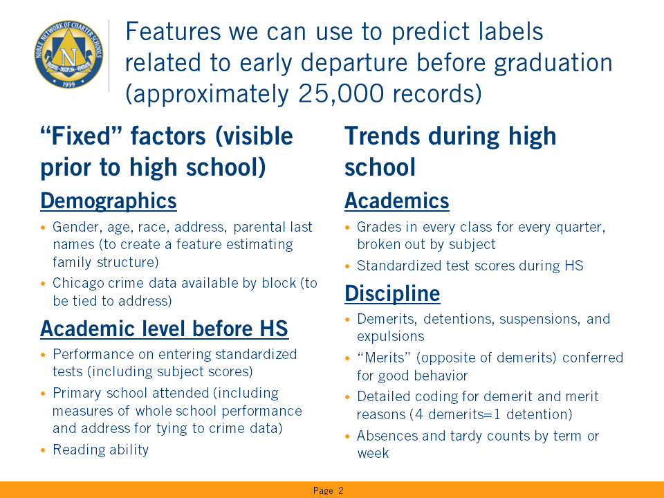
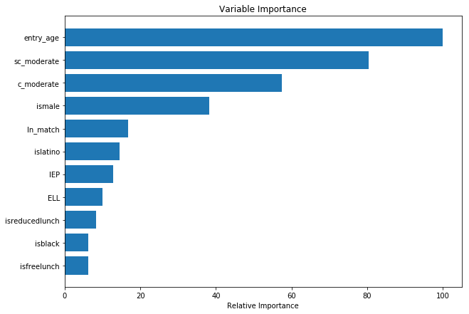
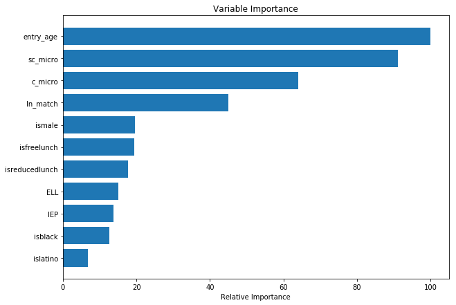
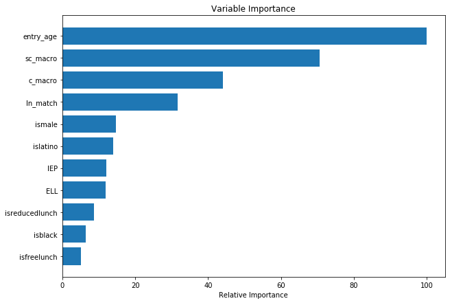
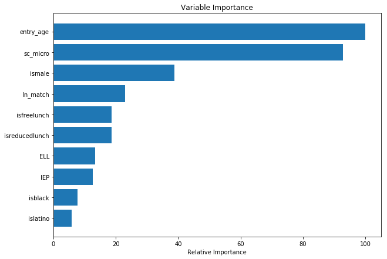
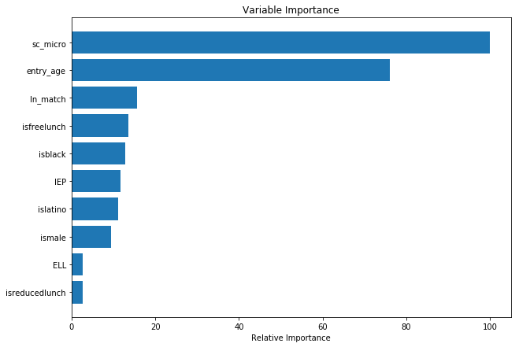
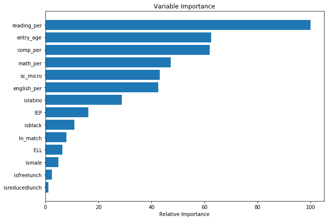

*Author*: Matt Niksch

*Synopsis*:
- Noble is a non-profit operator of 17 high schools in Chicago and serves more than 10% of public high school students in the city
- Student outcomes, including high school graduation, test score growth, GPA, college matriculation & completion are very strong
- However, although better than nearby options, too many students leave Noble and transfer to other schools. We would like to predict which students are likely to leave in order to provide them with more supports.

### Summary of potential features we might use to predict labels related to student depature:


## This page describes an initial analysis to attempting to predict departures in the first year


```python
import pandas as pd
import numpy as np
%matplotlib inline
import matplotlib.pyplot as plt
```


```python
LABEL = 'leave_in_yr1'

# First we need to load the data (see prior workbooks for details)
input_file = 'ninth_grade_features.csv'

df = pd.read_csv(input_file, encoding='cp1252', index_col=0)
df.info()
```

    <class 'pandas.core.frame.DataFrame'>
    Int64Index: 24244 entries, 20130160 to 42163228
    Data columns (total 34 columns):
    leave_in_yr1         24244 non-null int64
    campus               24244 non-null object
    GENDER               24244 non-null object
    ln_match             24244 non-null int64
    ismale               24244 non-null int64
    isblack              24244 non-null int64
    islatino             24244 non-null int64
    IEP                  24244 non-null int64
    ELL                  24244 non-null int64
    isfreelunch          24244 non-null int64
    isreducedlunch       24244 non-null int64
    LUNCHSTATUS          24244 non-null object
    entry_age            24244 non-null float64
    ENTRYDATE            24244 non-null object
    ENTRYMONTH           24244 non-null int64
    ENTRY_GRADE_LEVEL    24244 non-null int64
    ENTRY_SCHOOLYEAR     24244 non-null int64
    ENTRY_SEMESTER       24244 non-null object
    ETHNICITY            23810 non-null object
    EXITCODE             16647 non-null object
    days_enrolled        24244 non-null int64
    EXITDATE             24244 non-null object
    EXIT_GRADE_LEVEL     24244 non-null int64
    c_micro              24244 non-null int64
    sc_micro             24244 non-null int64
    c_moderate           24244 non-null int64
    sc_moderate          24244 non-null int64
    c_macro              24244 non-null int64
    sc_macro             24244 non-null int64
    comp_per             22743 non-null float64
    english_per          22743 non-null float64
    reading_per          22743 non-null float64
    math_per             22743 non-null float64
    science_per          22743 non-null float64
    dtypes: float64(6), int64(20), object(8)
    memory usage: 5.7+ MB
    

## We'll take a few minutes to look at the data


```python
#Number of students in each class
class_counts = df['ENTRY_SCHOOLYEAR'].value_counts().sort_index(0)
print(class_counts)
```

    2008    1102
    2009    1742
    2010    2232
    2011    2157
    2012    2691
    2013    3028
    2014    3520
    2015    3965
    2016    3807
    Name: ENTRY_SCHOOLYEAR, dtype: int64
    

### This is the number of students starting at Noble each year as new high school freshmen
For our analysis, we'll try to ignore 2016 initially because we had a substantially different set of discipline policy in the past year only. For predictions, we'll use 2008-2014 data to train the model and then test with 2015.

### Let's get an initial understanding of the number of students leaving in their first year at Noble:


```python
for year in class_counts.index:
    print('For entering class of {}, {:2.0%} of students left in the first year'.format(
        year, len(df[(df['ENTRY_SCHOOLYEAR']==year)&(df[LABEL]==1)])/class_counts[year]))
```

    For entering class of 2008, 14% of students left in the first year
    For entering class of 2009, 15% of students left in the first year
    For entering class of 2010, 16% of students left in the first year
    For entering class of 2011, 14% of students left in the first year
    For entering class of 2012, 16% of students left in the first year
    For entering class of 2013, 18% of students left in the first year
    For entering class of 2014, 20% of students left in the first year
    For entering class of 2015, 16% of students left in the first year
    For entering class of 2016, 16% of students left in the first year
    

### We tend to graduate fewer male students than female students, so let's check for male students specifically:


```python
for year in class_counts.index:
    print('For entering class of {}, {:2.0%} of male students left in the first year'.format(
        year, len(df[(df['ENTRY_SCHOOLYEAR']==year)&(df[LABEL]==1)&(df['ismale']==1)])/
              len(df[(df['ENTRY_SCHOOLYEAR']==year)&               (df['ismale']==1)])))
```

    For entering class of 2008, 16% of male students left in the first year
    For entering class of 2009, 18% of male students left in the first year
    For entering class of 2010, 16% of male students left in the first year
    For entering class of 2011, 15% of male students left in the first year
    For entering class of 2012, 18% of male students left in the first year
    For entering class of 2013, 19% of male students left in the first year
    For entering class of 2014, 20% of male students left in the first year
    For entering class of 2015, 17% of male students left in the first year
    For entering class of 2016, 16% of male students left in the first year
    

### This is surprising, but we'll do one more check for African American male students, who our practitioners suggest tend to struggle the most


```python
for year in class_counts.index:
    print('For entering class of {}, {:2.0%} of male students left in the first year'.format(
        year, len(df[(df['ENTRY_SCHOOLYEAR']==year)&(df[LABEL]==1)&(df['ismale']==1)&(df['isblack']==1)])/
              len(df[(df['ENTRY_SCHOOLYEAR']==year)&               (df['ismale']==1)&(df['isblack']==1)])))
```

    For entering class of 2008, 28% of male students left in the first year
    For entering class of 2009, 33% of male students left in the first year
    For entering class of 2010, 23% of male students left in the first year
    For entering class of 2011, 21% of male students left in the first year
    For entering class of 2012, 24% of male students left in the first year
    For entering class of 2013, 23% of male students left in the first year
    For entering class of 2014, 25% of male students left in the first year
    For entering class of 2015, 20% of male students left in the first year
    For entering class of 2016, 18% of male students left in the first year
    

## This is promising. Although this subgroup is doing worse than average, the recent gap is LESS than it was in earlier years

Let's move forward with trying to build a model to predict students leaving in the first year.

We'll eventually want to use incoming test scores, but we'll exclude those at first because we can't collect them for students who leave in the first month of school.


```python
X = [
    'ln_match', #dummy variable true if student last name matches last names provided for two parents
    'ismale',
    'isblack',
    'islatino',
    'isfreelunch', # qualify for free lunch (our best measure of poverty)
    'isreducedlunch', # reduced price lunch
    'IEP', # a student who has an Individualized Educational Plan, also known as "special education"
    'ELL', # the student is classified as an English Language Learner
    'entry_age', #their decimal age on the first day of 9th grade
    'c_moderate', #overall crime within a quarter square mile box centered on their home address
    'sc_moderate', #serious crime in the same (defined as murder, involving guns or other dangerous weapon, or drugs)
]

train_years = range(2008,2015) # This focuses on 2008-2014 because of the way Python indexes
test_years = [2015]
df_train = df[df['ENTRY_SCHOOLYEAR'].isin(train_years)]
X_train = df_train[X]
y_train = df_train[LABEL]
df_test = df[df['ENTRY_SCHOOLYEAR'].isin(test_years)].copy()
X_test = df_test[X]
y_test = df_test[LABEL]
```

## We'll try GradientBoost first


```python
from sklearn import ensemble
clf = ensemble.GradientBoostingRegressor()
clf.fit(X_train, y_train)
```


    GradientBoostingRegressor(alpha=0.9, criterion='friedman_mse', init=None,
                 learning_rate=0.1, loss='ls', max_depth=3, max_features=None,
                 max_leaf_nodes=None, min_impurity_decrease=0.0,
                 min_impurity_split=None, min_samples_leaf=1,
                 min_samples_split=2, min_weight_fraction_leaf=0.0,
                 n_estimators=100, presort='auto', random_state=None,
                 subsample=1.0, verbose=0, warm_start=False)


### Now that we have a fit, we'll need to build a function to assess the quality of the prediction


```python
def assess_prediction(df, y, prediction):
    print('Average prediction: {}'.format(np.mean(df[prediction])))
    score = ((df[prediction]>=0.5) & (df[y]==1)) | ((df[prediction]<0.5) & (df[y]==0))
    error_rate = ((df[prediction]>=0.5) & (df[y]==0)) | ((df[prediction]<0.5) & (df[y]==1))
    print('Overall score: {:.0%}'.format(sum(score)/len(score)))
    print('Score by decile of prediction:\n   range,   n, prediction average, average outcome, score, avg error):')
    for i in range(10):
        lim = [i*0.1, 0.1+i*0.1]
        d_slice_df = df[(df[prediction]>=lim[0]) & (df[prediction]<lim[1])]

        slice_score = ((d_slice_df[prediction]>=0.5) & (d_slice_df[y]==1)) | ((d_slice_df[prediction]<0.5) & (d_slice_df[y]==0))
        if not len(d_slice_df):
            print('{:3.0%}-{:4.0%}, (n/a)'.format(lim[0],lim[1]))
        else:    
            print('{:3.0%}-{:4.0%}, {:3d}, {:18.1%}, {:15.1%}, {:5.0%}, {:7.1%}'.format(
                lim[0],lim[1],len(d_slice_df),
                d_slice_df[prediction].mean(),
                d_slice_df[y].mean(),
                sum(slice_score)/len(slice_score),
                d_slice_df[prediction].mean()-d_slice_df[y].mean()))
```


```python
df_test['GradientPrediction'] = clf.predict(X_test)
assess_prediction(df_test, LABEL, 'GradientPrediction')
```

    Average prediction: 0.16683558165038895
    Overall score: 84%
    Score by decile of prediction:
       range,   n, prediction average, average outcome, score, avg error):
     0%- 10%, 1085,               7.0%,            6.4%,   94%,    0.6%
    10%- 20%, 1605,              15.5%,           13.7%,   86%,    1.8%
    20%- 30%, 963,              23.8%,           22.1%,   78%,    1.7%
    30%- 40%, 262,              33.7%,           43.5%,   56%,   -9.8%
    40%- 50%,  27,              43.9%,           59.3%,   41%,  -15.4%
    50%- 60%,   6,              53.0%,           33.3%,   33%,   19.7%
    60%- 70%,   6,              65.2%,           50.0%,   50%,   15.2%
    70%- 80%, (n/a)
    80%- 90%,   1,              86.4%,            0.0%,    0%,   86.4%
    90%-100%, (n/a)
    

# Overall, this looks like a strong model
### Without test score data, I'm surprised that it worked so well. Let's see what features were most powerful

N.B.: Keep in mind that a positive result="leaving" or the thing we're trying to avoid. In other words, the 1,055 students with a 0-10% prediction we estimated to have only a 7.2% chance of leaving on average and in actuality 8.1% of them left


```python
# Plot feature importance
def plot_feature_importance(clf, X):
    feature_importance = clf.feature_importances_
    # make importances relative to max importance
    feature_importance = 100.0 * (feature_importance / feature_importance.max())
    sorted_idx = np.argsort(feature_importance)
    pos = np.arange(sorted_idx.shape[0]) + .5
    plt.rcParams['figure.figsize'] = [10.0, 7.0]
    plt.barh(pos, feature_importance[sorted_idx], align='center')
    tickers = [x for _,x in sorted(zip(sorted_idx,X))]
    plt.yticks(pos, tickers)
    plt.xlabel('Relative Importance')
    plt.title('Variable Importance')
    plt.show()
plot_feature_importance(clf, X)
```





## Somewhat surprising that age is such a powerful component

We have two other "windows" for crime, though. Let's try this again with those windows for x


```python
X[-2]='c_micro'
X[-1]='sc_micro'
df_train = df[df['ENTRY_SCHOOLYEAR'].isin(train_years)]
X_train = df_train[X]
y_train = df_train[LABEL]
df_test = df[df['ENTRY_SCHOOLYEAR'].isin(test_years)].copy()
X_test = df_test[X]
y_test = df_test[LABEL]
clf = ensemble.GradientBoostingRegressor()
clf.fit(X_train, y_train)
df_test['GradientPrediction'] = clf.predict(X_test)
assess_prediction(df_test, LABEL, 'GradientPrediction')
plot_feature_importance(clf, X)
```

    Average prediction: 0.1657896920936279
    Overall score: 84%
    Score by decile of prediction:
       range,   n, prediction average, average outcome, score, avg error):
     0%- 10%, 1139,               7.1%,            6.8%,   93%,    0.3%
    10%- 20%, 1576,              15.6%,           12.7%,   87%,    2.9%
    20%- 30%, 942,              23.9%,           22.6%,   77%,    1.3%
    30%- 40%, 260,              33.7%,           47.3%,   53%,  -13.6%
    40%- 50%,  25,              44.1%,           64.0%,   36%,  -19.9%
    50%- 60%,  10,              53.0%,           50.0%,   50%,    3.0%
    60%- 70%,   2,              65.6%,          100.0%,  100%,  -34.4%
    70%- 80%,   1,              78.0%,            0.0%,    0%,   78.0%
    80%- 90%, (n/a)
    90%-100%, (n/a)
    





## This looks similar in accuracy, although the crime was relatively more important
### Finally, let's try the big window


```python
X[-2]='c_macro'
X[-1]='sc_macro'
df_train = df[df['ENTRY_SCHOOLYEAR'].isin(train_years)]
X_train = df_train[X]
y_train = df_train[LABEL]
df_test = df[df['ENTRY_SCHOOLYEAR'].isin(test_years)].copy()
X_test = df_test[X]
y_test = df_test[LABEL]
clf = ensemble.GradientBoostingRegressor()
clf.fit(X_train, y_train)
df_test['GradientPrediction'] = clf.predict(X_test)
assess_prediction(df_test, LABEL, 'GradientPrediction')
plot_feature_importance(clf, X)
```

    Average prediction: 0.16870341828968602
    Overall score: 84%
    Score by decile of prediction:
       range,   n, prediction average, average outcome, score, avg error):
     0%- 10%, 999,               7.1%,            5.8%,   94%,    1.3%
    10%- 20%, 1687,              15.3%,           13.0%,   87%,    2.3%
    20%- 30%, 940,              23.7%,           22.8%,   77%,    0.9%
    30%- 40%, 282,              33.3%,           44.0%,   56%,  -10.6%
    40%- 50%,  28,              44.7%,           46.4%,   54%,   -1.8%
    50%- 60%,  11,              54.9%,           54.5%,   55%,    0.3%
    60%- 70%,   6,              65.2%,           50.0%,   50%,   15.2%
    70%- 80%,   2,              70.5%,            0.0%,    0%,   70.5%
    80%- 90%, (n/a)
    90%-100%, (n/a)
    





## Still similar. Let's try micro only with only serious crime and not overall crime


```python
X[-2]='sc_micro'
_ = X.pop()
df_train = df[df['ENTRY_SCHOOLYEAR'].isin(train_years)]
X_train = df_train[X]
y_train = df_train[LABEL]
df_test = df[df['ENTRY_SCHOOLYEAR'].isin(test_years)].copy()
X_test = df_test[X]
y_test = df_test[LABEL]
clf = ensemble.GradientBoostingRegressor()
clf.fit(X_train, y_train)
df_test['GradientPrediction'] = clf.predict(X_test)
assess_prediction(df_test, LABEL, 'GradientPrediction')
plot_feature_importance(clf, X)
```

    Average prediction: 0.16632160145298405
    Overall score: 84%
    Score by decile of prediction:
       range,   n, prediction average, average outcome, score, avg error):
     0%- 10%, 1105,               6.9%,            6.6%,   93%,    0.3%
    10%- 20%, 1601,              15.5%,           13.2%,   87%,    2.3%
    20%- 30%, 957,              24.0%,           22.3%,   78%,    1.7%
    30%- 40%, 248,              34.2%,           44.0%,   56%,   -9.7%
    40%- 50%,  27,              42.1%,           81.5%,   19%,  -39.4%
    50%- 60%,  13,              53.4%,           53.8%,   54%,   -0.5%
    60%- 70%,   1,              67.6%,          100.0%,  100%,  -32.4%
    70%- 80%,   1,              73.5%,            0.0%,    0%,   73.5%
    80%- 90%, (n/a)
    90%-100%,   1,              96.8%,            0.0%,    0%,   96.8%
    





## Without the two (correlated) crime variables splitting the prediction, serious crime ends up being a more important factor; we'll stick with this as our sole crime factor for now
### Let's try this now with a few more models


```python
clf = ensemble.RandomForestRegressor()
clf.fit(X_train, y_train)
df_test['RFPrediction'] = clf.predict(X_test)
assess_prediction(df_test, LABEL, 'RFPrediction')
plot_feature_importance(clf, X)
```

    Average prediction: 0.18199803659933966
    Overall score: 80%
    Score by decile of prediction:
       range,   n, prediction average, average outcome, score, avg error):
     0%- 10%, 1716,               1.5%,           11.4%,   89%,   -9.9%
    10%- 20%, 836,              13.0%,           14.7%,   85%,   -1.7%
    20%- 30%, 570,              24.4%,           18.6%,   81%,    5.8%
    30%- 40%, 216,              34.9%,           19.9%,   80%,   15.0%
    40%- 50%, 207,              42.7%,           21.3%,   79%,   21.4%
    50%- 60%, 135,              52.4%,           23.7%,   24%,   28.7%
    60%- 70%, 101,              67.6%,           29.7%,   30%,   37.9%
    70%- 80%,  22,              74.3%,           22.7%,   23%,   51.6%
    80%- 90%,  51,              81.8%,           25.5%,   25%,   56.4%
    90%-100%,  40,              90.4%,           50.0%,   50%,   40.4%
    





## Now, let's try to look only at the students for whom we have test scores

Possibly, this will reduce the power of age if we believe older students will tend to be struggling academically


```python
X = X+['comp_per','english_per','reading_per','math_per'] # percentile scores on early 9th assessments (comp is composite)
df_train = df[(df['ENTRY_SCHOOLYEAR'].isin(train_years))&(~np.isnan(df['comp_per']))]
X_train = df_train[X]
y_train = df_train[LABEL]
df_test = df[(df['ENTRY_SCHOOLYEAR'].isin(test_years))&(~np.isnan(df['comp_per']))].copy()
X_test = df_test[X]
y_test = df_test[LABEL]
```


```python
clf = ensemble.GradientBoostingRegressor()
clf.fit(X_train, y_train)
df_test['GradientPrediction'] = clf.predict(X_test)
assess_prediction(df_test, LABEL, 'GradientPrediction')
plot_feature_importance(clf, X)
```

    Average prediction: 0.1398068504012787
    Overall score: 89%
    Score by decile of prediction:
       range,   n, prediction average, average outcome, score, avg error):
     0%- 10%, 1307,               6.1%,            5.5%,   94%,    0.6%
    10%- 20%, 1537,              14.6%,           12.2%,   88%,    2.3%
    20%- 30%, 530,              23.8%,           18.5%,   82%,    5.3%
    30%- 40%, 153,              34.3%,           20.3%,   80%,   14.1%
    40%- 50%,  31,              43.8%,           32.3%,   68%,   11.6%
    50%- 60%,   4,              54.0%,           75.0%,   75%,  -21.0%
    60%- 70%, (n/a)
    70%- 80%,   2,              73.9%,           50.0%,   50%,   23.9%
    80%- 90%, (n/a)
    90%-100%, (n/a)
    





# This is exactly as predicted!
Reading was guessed by our discipline team to be the core predictor

## We'll stop for now, but this is surprisingly powerful


