# Building a model to predict the college persistence of high school alumni
<i>Author:</i> Matt Niksch
<p><i>Synopsis</i>: Prior to the start of this project, an initial model has been built to predict which alumni of a high school network will persist in college. The purpose of this project is to reinvestigate that model and potentially augment it with free text responses from students using natural language processing.
<p>While the ultimate goal for the network is to have alumni persist through 4 years of college and earn bachelor's degrees, we estimate over 2/3 of students who leave college do so prior to the start of sophomore year. As such, the focus of this project is on predicting persistence to sophomore year. The College Success field uses two standard definitions to discuss these results:
* <b>Retention</b>: defined as being enrolled one year later at the initial college you began at as a first-time, full-time freshman; technically, a student could have retention if they skip the second semester of freshman year, but we'll use a stricter definition requiring continuous enrollment to the 3rd semester or 4th quarter
* <b>Persistence</b>: similar to retention but allows for transfers; students persist as long as they stay in a college, at any college

# Overview of the available data
The data used for this project comes from two main sources:
1. Survey data from an exit survey taken the month before students graduated from high school
2. A single file preprocessed to contain demographic information, high school summative performance, and college persistence results (through one year of college)

## Exploration of survey data
One source of potential features for this analysis is a set of survey questions given to students who have graduated from Noble over the last 3 years. This is potentially very useful, but this particular data suffers from a number of limitations:
* Only the graduates from the Classes of 2015, 2016, and 2017 took the survey; we currently only have college persistence data for the Classes of 2015 and earlier
* In 2015 and 2016 in particular, a handful of campuses did not administer the survey
* The questions have remained the same every year for consistency, but a handful of the Likert style questions have different directions for agreement (i.e. within the questions for one construct, some questions measure highest agreement with a 5 and others with a 1 on a 1-5 scale.)


```python
# This snippet of code reads in the raw survey data and the Notebook below examines it

import pandas as pd
import numpy as np
%matplotlib inline
import matplotlib.pyplot as plt

survey_data_file = 'inputs/Senior_Survey_Data.csv' # Raw survey responses
sdf = pd.read_csv(survey_data_file, encoding='cp1252', index_col=0)
sdf.head()
```


<div>
<table border="1" class="dataframe">
  <thead>
    <tr style="text-align: right;">
      <th></th>
      <th>HS_Class</th>
      <th>N</th>
      <th>Self_Concept0</th>
      <th>Self_Concept1</th>
      <th>Self_Concept2</th>
      <th>Self_Concept3</th>
      <th>Self_Concept4</th>
      <th>Self_Concept5</th>
      <th>Self_Concept6</th>
      <th>Self_Concept7</th>
      <th>...</th>
      <th>Performance_Avoidance1</th>
      <th>Performance_Avoidance2</th>
      <th>Performance_Avoidance3</th>
      <th>Performance_Avoidance4</th>
      <th>Performance_Avoidance5</th>
      <th>Self_Regulation1</th>
      <th>Self_Regulation2</th>
      <th>Self_Regulation3</th>
      <th>Self_Regulation4</th>
      <th>HS_Preparation</th>
    </tr>
    <tr>
      <th>SID</th>
      <th></th>
      <th></th>
      <th></th>
      <th></th>
      <th></th>
      <th></th>
      <th></th>
      <th></th>
      <th></th>
      <th></th>
      <th></th>
      <th></th>
      <th></th>
      <th></th>
      <th></th>
      <th></th>
      <th></th>
      <th></th>
      <th></th>
      <th></th>
      <th></th>
    </tr>
  </thead>
  <tbody>
    <tr>
      <th>34600104</th>
      <td>2016</td>
      <td>50</td>
      <td>Average</td>
      <td>Average</td>
      <td>Average</td>
      <td>Above average</td>
      <td>Average</td>
      <td>Average</td>
      <td>Average</td>
      <td>Average</td>
      <td>...</td>
      <td>A little true</td>
      <td>Somewhat true</td>
      <td>Not at all true</td>
      <td>Not at all true</td>
      <td>Not at all true</td>
      <td>A little like me</td>
      <td>Somewhat like me</td>
      <td>Somewhat like me</td>
      <td>A little like me</td>
      <td>Somewhat well</td>
    </tr>
    <tr>
      <th>38994980</th>
      <td>2016</td>
      <td>51</td>
      <td>Average</td>
      <td>Above average</td>
      <td>Above average</td>
      <td>Above average</td>
      <td>Above average</td>
      <td>Above average</td>
      <td>Above average</td>
      <td>Above average</td>
      <td>...</td>
      <td>Not at all true</td>
      <td>Not at all true</td>
      <td>Not at all true</td>
      <td>Not at all true</td>
      <td>Not at all true</td>
      <td>Not at all like me</td>
      <td>Not at all like me</td>
      <td>Not at all like me</td>
      <td>Not at all like me</td>
      <td>Somewhat well</td>
    </tr>
    <tr>
      <th>39650495</th>
      <td>2016</td>
      <td>49</td>
      <td>Average</td>
      <td>Above average</td>
      <td>Above average</td>
      <td>Above average</td>
      <td>Average</td>
      <td>Above average</td>
      <td>Average</td>
      <td>Average</td>
      <td>...</td>
      <td>A little true</td>
      <td>Not at all true</td>
      <td>A little true</td>
      <td>Not at all true</td>
      <td>Mostly true</td>
      <td>A little like me</td>
      <td>Not at all like me</td>
      <td>Not at all like me</td>
      <td>A little like me</td>
      <td>Somewhat well</td>
    </tr>
    <tr>
      <th>39663376</th>
      <td>2016</td>
      <td>49</td>
      <td>Average</td>
      <td>Above average</td>
      <td>Average</td>
      <td>Average</td>
      <td>Average</td>
      <td>Average</td>
      <td>Average</td>
      <td>Below average</td>
      <td>...</td>
      <td>Not at all true</td>
      <td>Not at all true</td>
      <td>Not at all true</td>
      <td>A little true</td>
      <td>A little true</td>
      <td>A little like me</td>
      <td>A little like me</td>
      <td>A little like me</td>
      <td>Not at all like me</td>
      <td>Somewhat well</td>
    </tr>
    <tr>
      <th>39665123</th>
      <td>2016</td>
      <td>50</td>
      <td>Above average</td>
      <td>Average</td>
      <td>Above average</td>
      <td>Average</td>
      <td>Average</td>
      <td>Average</td>
      <td>Average</td>
      <td>Below average</td>
      <td>...</td>
      <td>A little true</td>
      <td>Somewhat true</td>
      <td>Not at all true</td>
      <td>Not at all true</td>
      <td>A little true</td>
      <td>Not at all like me</td>
      <td>Not at all like me</td>
      <td>Not at all like me</td>
      <td>Not at all like me</td>
      <td>Very well</td>
    </tr>
  </tbody>
</table>
<p>5 rows × 52 columns</p>
</div>


```python
# In order to interpret the ordinal data and create an overall numeric score for each construct, a key is used

survey_key_file = 'inputs/Senior_Survey_Key.csv' # Metadata about the survey
skf = pd.read_csv(survey_key_file, encoding='cp1252')
skf.head()
```


<div>
<table border="1" class="dataframe">
  <thead>
    <tr style="text-align: right;">
      <th></th>
      <th>Key</th>
      <th>1</th>
      <th>2</th>
      <th>3</th>
      <th>4</th>
      <th>5</th>
    </tr>
  </thead>
  <tbody>
    <tr>
      <th>0</th>
      <td>Self_Concept0</td>
      <td>Below average</td>
      <td>Not Used</td>
      <td>Average</td>
      <td>Not Used</td>
      <td>Above average</td>
    </tr>
    <tr>
      <th>1</th>
      <td>Self_Concept1</td>
      <td>Below average</td>
      <td>Not Used</td>
      <td>Average</td>
      <td>Not Used</td>
      <td>Above average</td>
    </tr>
    <tr>
      <th>2</th>
      <td>Self_Concept2</td>
      <td>Below average</td>
      <td>Not Used</td>
      <td>Average</td>
      <td>Not Used</td>
      <td>Above average</td>
    </tr>
    <tr>
      <th>3</th>
      <td>Self_Concept3</td>
      <td>Below average</td>
      <td>Not Used</td>
      <td>Average</td>
      <td>Not Used</td>
      <td>Above average</td>
    </tr>
    <tr>
      <th>4</th>
      <td>Self_Concept4</td>
      <td>Below average</td>
      <td>Not Used</td>
      <td>Average</td>
      <td>Not Used</td>
      <td>Above average</td>
    </tr>
  </tbody>
</table>
</div>


```python
columns = sdf.columns

# The first two columns of the data define the graduating year of the students and the number of survey questions
# responded to

columns[:2]
```


    Index(['HS_Class', 'N'], dtype='object')


```python
# The rest of the columns contain ordinal text data based on student responses to questions measuring
# a number of psychological constructs

questions = list(skf.Key)
question_groups = list(set([q[:-1] if q[-1].isdigit() else q
                                for q in questions]))
question_hierarchy = {qg:[q for q in questions if q.startswith(qg)]
                         for qg in question_groups}

for key, items in question_hierarchy.items():
    print('{}: {} questions'.format(key, len(items)))

# Here are the names for the constructs being measured by the questions along with the number of questions per construct:
```

    Self_Regulation: 4 questions
    Support_Networks_School: 2 questions
    Organization_Time_Management: 4 questions
    Intrinsic_Motivation: 4 questions
    Performance_Avoidance: 5 questions
    Academic_Identity: 6 questions
    Academic_Delay_of_Gratification: 3 questions
    Support_Networks_Family: 5 questions
    HS_Preparation: 1 questions
    Self_Concept: 10 questions
    Growth_Mindset_Self_Efficacy: 6 questions
    


```python
# This code below maps the raw survey data to the key information, developing a single score per construct per student
def map_numbers(raw_answer, mapping_dict):
    '''applied function to map a raw survey answer to a number'''
    if pd.isnull(raw_answer):
        return np.NaN
    if raw_answer in mapping_dict:
        return mapping_dict[raw_answer]
    else:
        return -1

map_d = {}
for i in range(len(skf)):
    item = skf.loc[i].tolist()
    item_d = {}
    for j in range(1, len(item)):
        ref = int(item[j]) if item[j].isdigit() else item[j]
        item_d[ref] = j # this works because column headers are 1-5
    map_d[item[0]] = item_d

answers_df = sdf.copy()
for i in range(2,len(answers_df.iloc[0])):
    answers_df.iloc[:,i] = answers_df.iloc[:,i].apply(
            map_numbers, args=[map_d[answers_df.columns[i]]])

# Collapse scores into groups for each student
group_scores = sdf.iloc[:,:1].copy()
for group, qs in question_hierarchy.items():
    these_qs = answers_df[qs]
    this_group = these_qs.mean(axis=1)
    this_group.name = group
    group_scores = pd.concat([group_scores, this_group], axis=1)

group_scores.head()

# As a result of this code, we have a single score for each student for each of the constructs
```


<div>
<table border="1" class="dataframe">
  <thead>
    <tr style="text-align: right;">
      <th></th>
      <th>HS_Class</th>
      <th>Self_Regulation</th>
      <th>Support_Networks_School</th>
      <th>Organization_Time_Management</th>
      <th>Intrinsic_Motivation</th>
      <th>Performance_Avoidance</th>
      <th>Academic_Identity</th>
      <th>Academic_Delay_of_Gratification</th>
      <th>Support_Networks_Family</th>
      <th>HS_Preparation</th>
      <th>Self_Concept</th>
      <th>Growth_Mindset_Self_Efficacy</th>
    </tr>
    <tr>
      <th>SID</th>
      <th></th>
      <th></th>
      <th></th>
      <th></th>
      <th></th>
      <th></th>
      <th></th>
      <th></th>
      <th></th>
      <th></th>
      <th></th>
      <th></th>
    </tr>
  </thead>
  <tbody>
    <tr>
      <th>34600104</th>
      <td>2016</td>
      <td>3.50</td>
      <td>4.0</td>
      <td>3.5</td>
      <td>4</td>
      <td>4.4</td>
      <td>3.500000</td>
      <td>3.000000</td>
      <td>4.6</td>
      <td>4</td>
      <td>3.2</td>
      <td>4.000000</td>
    </tr>
    <tr>
      <th>38994980</th>
      <td>2016</td>
      <td>5.00</td>
      <td>4.5</td>
      <td>5.0</td>
      <td>4</td>
      <td>5.0</td>
      <td>4.333333</td>
      <td>5.000000</td>
      <td>4.0</td>
      <td>4</td>
      <td>4.8</td>
      <td>5.000000</td>
    </tr>
    <tr>
      <th>39650495</th>
      <td>2016</td>
      <td>4.50</td>
      <td>5.0</td>
      <td>4.5</td>
      <td>5</td>
      <td>4.0</td>
      <td>4.500000</td>
      <td>4.000000</td>
      <td>3.6</td>
      <td>4</td>
      <td>3.8</td>
      <td>3.333333</td>
    </tr>
    <tr>
      <th>39663376</th>
      <td>2016</td>
      <td>4.25</td>
      <td>4.5</td>
      <td>2.0</td>
      <td>4</td>
      <td>4.6</td>
      <td>4.333333</td>
      <td>3.500000</td>
      <td>4.2</td>
      <td>4</td>
      <td>3.2</td>
      <td>3.833333</td>
    </tr>
    <tr>
      <th>39665123</th>
      <td>2016</td>
      <td>5.00</td>
      <td>5.0</td>
      <td>3.0</td>
      <td>5</td>
      <td>4.2</td>
      <td>4.333333</td>
      <td>4.333333</td>
      <td>5.0</td>
      <td>5</td>
      <td>3.4</td>
      <td>4.666667</td>
    </tr>
  </tbody>
</table>
</div>


```python
# A histogram for each construct:

for question in question_hierarchy:
    pd.DataFrame.hist(group_scores,column=question)
```


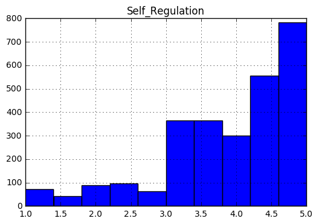


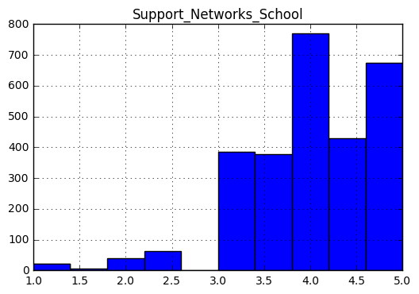


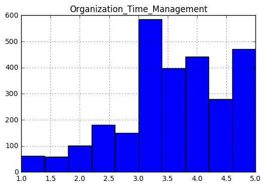


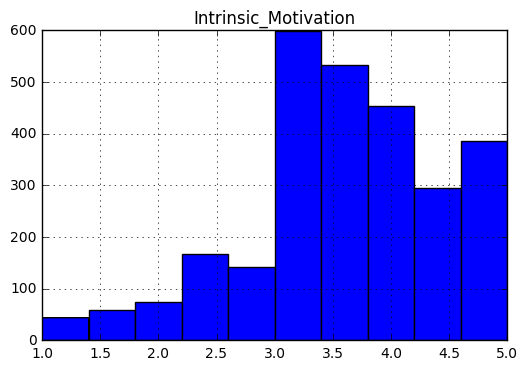


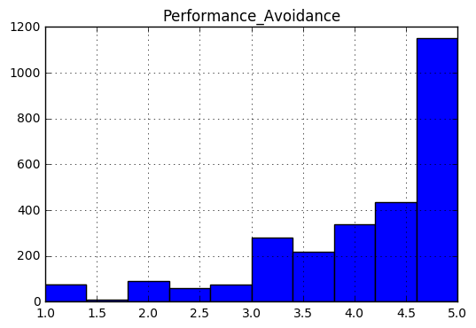


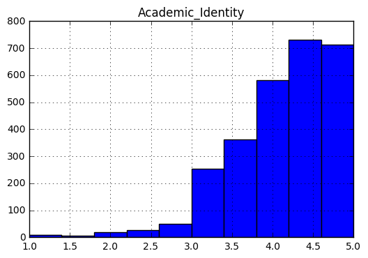


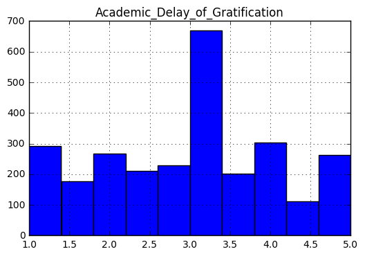


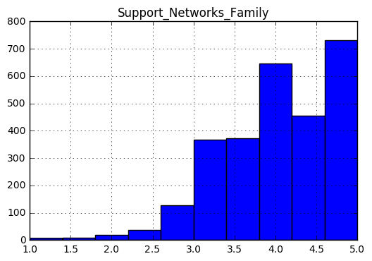


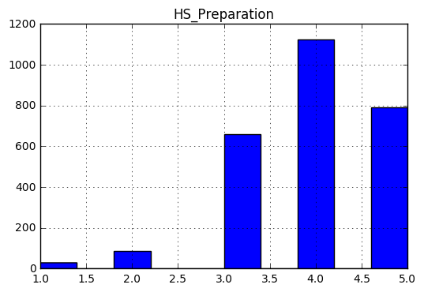


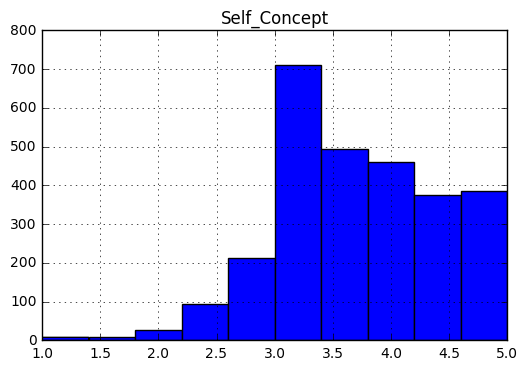


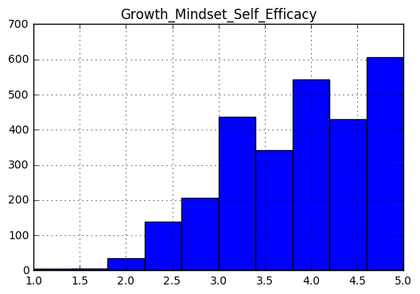


```python
# As you can see from the plots, a number of these measures seem to be biased towards high or "perfect" scores.
# It might be interesting to check their correlations:

print(group_scores.corr())
```

                                     HS_Class  Self_Regulation  \
    HS_Class                         1.000000        -0.012907   
    Self_Regulation                 -0.012907         1.000000   
    Support_Networks_School         -0.086440         0.251442   
    Organization_Time_Management     0.011954         0.291007   
    Intrinsic_Motivation            -0.023083         0.328598   
    Performance_Avoidance           -0.036435         0.687510   
    Academic_Identity               -0.024374         0.446635   
    Academic_Delay_of_Gratification  0.009310         0.182419   
    Support_Networks_Family         -0.006180         0.211162   
    HS_Preparation                  -0.004736         0.210123   
    Self_Concept                    -0.050729         0.240768   
    Growth_Mindset_Self_Efficacy    -0.032124         0.472741   
    
                                     Support_Networks_School  \
    HS_Class                                       -0.086440   
    Self_Regulation                                 0.251442   
    Support_Networks_School                         1.000000   
    Organization_Time_Management                    0.286817   
    Intrinsic_Motivation                            0.395210   
    Performance_Avoidance                           0.210280   
    Academic_Identity                               0.349714   
    Academic_Delay_of_Gratification                 0.193601   
    Support_Networks_Family                         0.311967   
    HS_Preparation                                  0.295108   
    Self_Concept                                    0.399672   
    Growth_Mindset_Self_Efficacy                    0.242442   
    
                                     Organization_Time_Management  \
    HS_Class                                             0.011954   
    Self_Regulation                                      0.291007   
    Support_Networks_School                              0.286817   
    Organization_Time_Management                         1.000000   
    Intrinsic_Motivation                                 0.589914   
    Performance_Avoidance                                0.078043   
    Academic_Identity                                    0.447272   
    Academic_Delay_of_Gratification                      0.655829   
    Support_Networks_Family                              0.350039   
    HS_Preparation                                       0.279218   
    Self_Concept                                         0.348282   
    Growth_Mindset_Self_Efficacy                         0.078563   
    
                                     Intrinsic_Motivation  Performance_Avoidance  \
    HS_Class                                    -0.023083              -0.036435   
    Self_Regulation                              0.328598               0.687510   
    Support_Networks_School                      0.395210               0.210280   
    Organization_Time_Management                 0.589914               0.078043   
    Intrinsic_Motivation                         1.000000               0.130334   
    Performance_Avoidance                        0.130334               1.000000   
    Academic_Identity                            0.552156               0.298417   
    Academic_Delay_of_Gratification              0.576259              -0.065722   
    Support_Networks_Family                      0.380195               0.153028   
    HS_Preparation                               0.364509               0.113726   
    Self_Concept                                 0.384165               0.265093   
    Growth_Mindset_Self_Efficacy                 0.176516               0.548099   
    
                                     Academic_Identity  \
    HS_Class                                 -0.024374   
    Self_Regulation                           0.446635   
    Support_Networks_School                   0.349714   
    Organization_Time_Management              0.447272   
    Intrinsic_Motivation                      0.552156   
    Performance_Avoidance                     0.298417   
    Academic_Identity                         1.000000   
    Academic_Delay_of_Gratification           0.288836   
    Support_Networks_Family                   0.388448   
    HS_Preparation                            0.324347   
    Self_Concept                              0.365528   
    Growth_Mindset_Self_Efficacy              0.399436   
    
                                     Academic_Delay_of_Gratification  \
    HS_Class                                                0.009310   
    Self_Regulation                                         0.182419   
    Support_Networks_School                                 0.193601   
    Organization_Time_Management                            0.655829   
    Intrinsic_Motivation                                    0.576259   
    Performance_Avoidance                                  -0.065722   
    Academic_Identity                                       0.288836   
    Academic_Delay_of_Gratification                         1.000000   
    Support_Networks_Family                                 0.249429   
    HS_Preparation                                          0.223771   
    Self_Concept                                            0.240278   
    Growth_Mindset_Self_Efficacy                           -0.034380   
    
                                     Support_Networks_Family  HS_Preparation  \
    HS_Class                                       -0.006180       -0.004736   
    Self_Regulation                                 0.211162        0.210123   
    Support_Networks_School                         0.311967        0.295108   
    Organization_Time_Management                    0.350039        0.279218   
    Intrinsic_Motivation                            0.380195        0.364509   
    Performance_Avoidance                           0.153028        0.113726   
    Academic_Identity                               0.388448        0.324347   
    Academic_Delay_of_Gratification                 0.249429        0.223771   
    Support_Networks_Family                         1.000000        0.245648   
    HS_Preparation                                  0.245648        1.000000   
    Self_Concept                                    0.326281        0.219774   
    Growth_Mindset_Self_Efficacy                    0.185735        0.167637   
    
                                     Self_Concept  Growth_Mindset_Self_Efficacy  
    HS_Class                            -0.050729                     -0.032124  
    Self_Regulation                      0.240768                      0.472741  
    Support_Networks_School              0.399672                      0.242442  
    Organization_Time_Management         0.348282                      0.078563  
    Intrinsic_Motivation                 0.384165                      0.176516  
    Performance_Avoidance                0.265093                      0.548099  
    Academic_Identity                    0.365528                      0.399436  
    Academic_Delay_of_Gratification      0.240278                     -0.034380  
    Support_Networks_Family              0.326281                      0.185735  
    HS_Preparation                       0.219774                      0.167637  
    Self_Concept                         1.000000                      0.305851  
    Growth_Mindset_Self_Efficacy         0.305851                      1.000000  
    


```python

```
