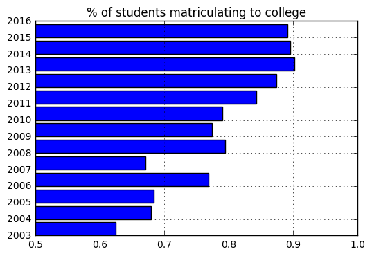
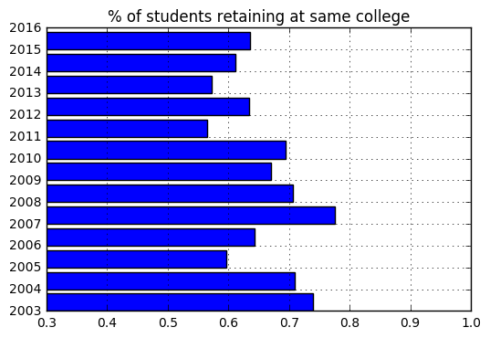
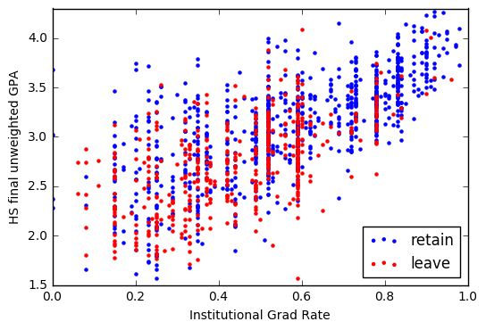

# Building a model to predict the college persistence of high school alumni

## File 2: exploration of the demographic and results data
<i>Author:</i> Matt Niksch
<p><i>Synopsis</i>: Prior to the start of this project, an initial model has been built to predict which alumni of a high school network will persist in college. The purpose of this project is to reinvestigate that model and potentially augment it with free text responses from students using natural language processing.
<p>While the ultimate goal for the network is to have alumni persist through 4 years of college and earn bachelor's degrees, we estimate over 2/3 of students who leave college do so prior to the start of sophomore year. As such, the focus of this project is on predicting persistence to sophomore year. The College Success field uses two standard definitions to discuss these results:
* <b>Retention</b>: defined as being enrolled one year later at the initial college you began at as a first-time, full-time freshman; technically, a student could have retention if they skip the second semester of freshman year, but we'll use a stricter definition requiring continuous enrollment to the 3rd semester or 4th quarter
* <b>Persistence</b>: similar to retention but allows for transfers; students persist as long as they stay in a college, at any college

# Overview of the available data
The data used for this project comes from two main sources:
1. Survey data from an exit survey taken the month before students graduated from high school
2. A single file preprocessed to contain demographic information, high school summative performance, and college persistence results (through one year of college)

## Exploration of file with preprocessed demographic info, high school summative performance, and college persistence results
A few notes about this file:
* This includes graduates from the Classes of 2003-2016, although persistence info doesn't exist for 2016. Also, older classes are assumed to be substantially different from more recent classes because (a) the high school training has changed and (b) the behavior of the colleges has also changed (although likely more slowly)
* There are a ton of features that have already been generated (in order of columns listed below:
    * Dummy variables for Black, Latino, White, Asian, Minority (Black/Latino), Low Income, Male, Special Education (SpEd), RandomSplit (for use in trial/test)
    * Numeric high school performance: ACT, GPA (unweighted & weighted), GPA_diff (weighted-unweighted)
    * Descriptive information about the student: Ids, HS Campus, College attainment (text), Current status (text)
    * Info about the first college: PGR (institutional grad rate), IRR (institutional retention rate), NCES (reference ID)
    * Dummy variables about first colleges: MCPlus, MC, HC, VC, C, NC, 2yr (institutional selectivity from highest to lowest), HBCU (Historically Black College or University)
    * Available potential labels: Retention3 (stayed enrolled at start institution to start of sophomore year), Persistence3 (stayed in any college for first 3 semesters), Retention5 (stayed enrolled at the same institution to start of junior year), BA_in6, Retention semesters, BA in X semesters
    * Text descriptions of enrolled colleges by semester


```python
import pandas as pd
import numpy as np
%matplotlib inline
import matplotlib.pyplot as plt

persistence_file = 'inputs/Persistence_Data.csv'
df = pd.read_csv(persistence_file, encoding='cp1252', index_col=0)
pd.set_option('display.max_columns',50)
df.head()
```


<div>
<table border="1" class="dataframe">
  <thead>
    <tr style="text-align: right;">
      <th></th>
      <th>Id</th>
      <th>IsBlack</th>
      <th>IsLatino</th>
      <th>IsWhite</th>
      <th>IsAsian</th>
      <th>IsMinority</th>
      <th>IsLowIncome</th>
      <th>IsMale</th>
      <th>ACT</th>
      <th>GPA</th>
      <th>WGPA</th>
      <th>GPA_diff</th>
      <th>Class</th>
      <th>RandomSplit</th>
      <th>IsSpEd</th>
      <th>Campus</th>
      <th>College attainment</th>
      <th>Current Status</th>
      <th>Initial PGR</th>
      <th>Initial IRR</th>
      <th>Initial NCES</th>
      <th>IsMCPlus</th>
      <th>IsMC</th>
      <th>IsHC</th>
      <th>IsVC</th>
      <th>IsC</th>
      <th>IsNC</th>
      <th>Is2yr</th>
      <th>IsInitialHBCU</th>
      <th>Retention3</th>
      <th>Persistence3</th>
      <th>Retention5</th>
      <th>BA_in6</th>
      <th>Retention semesters</th>
      <th>BA completed in X Semesters</th>
      <th>Initial College</th>
      <th>Sem 2 College</th>
      <th>Sem 3 College</th>
      <th>Sem 4 College</th>
      <th>Sem 5 College</th>
      <th>Sem 6 College</th>
      <th>Sem 7 College</th>
      <th>Sem 8 College</th>
      <th>Sem 9 College</th>
      <th>Sem 10 College</th>
      <th>Sem 11 College</th>
      <th>Sem 12 College</th>
    </tr>
    <tr>
      <th>SID</th>
      <th></th>
      <th></th>
      <th></th>
      <th></th>
      <th></th>
      <th></th>
      <th></th>
      <th></th>
      <th></th>
      <th></th>
      <th></th>
      <th></th>
      <th></th>
      <th></th>
      <th></th>
      <th></th>
      <th></th>
      <th></th>
      <th></th>
      <th></th>
      <th></th>
      <th></th>
      <th></th>
      <th></th>
      <th></th>
      <th></th>
      <th></th>
      <th></th>
      <th></th>
      <th></th>
      <th></th>
      <th></th>
      <th></th>
      <th></th>
      <th></th>
      <th></th>
      <th></th>
      <th></th>
      <th></th>
      <th></th>
      <th></th>
      <th></th>
      <th></th>
      <th></th>
      <th></th>
      <th></th>
      <th></th>
    </tr>
  </thead>
  <tbody>
    <tr>
      <th>39859416</th>
      <td>003E000000gsanXIAQ</td>
      <td>0</td>
      <td>1</td>
      <td>0</td>
      <td>0</td>
      <td>1</td>
      <td>1</td>
      <td>0</td>
      <td>20</td>
      <td>3.13</td>
      <td>3.15</td>
      <td>0.02</td>
      <td>2013</td>
      <td>1</td>
      <td>0</td>
      <td>Chicago Bulls</td>
      <td>Attending 4 yr</td>
      <td>Pursuing 4yr</td>
      <td>0.00</td>
      <td>NaN</td>
      <td>NaN</td>
      <td>NaN</td>
      <td>NaN</td>
      <td>NaN</td>
      <td>NaN</td>
      <td>NaN</td>
      <td>NaN</td>
      <td>NaN</td>
      <td>NaN</td>
      <td>NaN</td>
      <td>NaN</td>
      <td>NaN</td>
      <td>NaN</td>
      <td>0</td>
      <td>0</td>
      <td>NaN</td>
      <td>NaN</td>
      <td>NaN</td>
      <td>NaN</td>
      <td>National-Louis University</td>
      <td>National-Louis University</td>
      <td>National-Louis University</td>
      <td>National-Louis University</td>
      <td>NaN</td>
      <td>NaN</td>
      <td>NaN</td>
      <td>NaN</td>
    </tr>
    <tr>
      <th>40887733</th>
      <td>003E000000gsanYIAQ</td>
      <td>1</td>
      <td>0</td>
      <td>0</td>
      <td>0</td>
      <td>1</td>
      <td>0</td>
      <td>1</td>
      <td>18</td>
      <td>2.39</td>
      <td>2.42</td>
      <td>0.03</td>
      <td>2013</td>
      <td>1</td>
      <td>0</td>
      <td>Chicago Bulls</td>
      <td>Attended 4 yr</td>
      <td>No college</td>
      <td>0.49</td>
      <td>0.70</td>
      <td>149772</td>
      <td>0</td>
      <td>0</td>
      <td>0</td>
      <td>0</td>
      <td>1</td>
      <td>0</td>
      <td>0</td>
      <td>0</td>
      <td>0</td>
      <td>0</td>
      <td>0</td>
      <td>NaN</td>
      <td>2</td>
      <td>0</td>
      <td>Western Illinois University</td>
      <td>Western Illinois University</td>
      <td>NaN</td>
      <td>Western Illinois University</td>
      <td>NaN</td>
      <td>NaN</td>
      <td>NaN</td>
      <td>NaN</td>
      <td>NaN</td>
      <td>NaN</td>
      <td>NaN</td>
      <td>NaN</td>
    </tr>
    <tr>
      <th>40006648</th>
      <td>003E000000gsanZIAQ</td>
      <td>0</td>
      <td>1</td>
      <td>0</td>
      <td>0</td>
      <td>1</td>
      <td>0</td>
      <td>1</td>
      <td>30</td>
      <td>3.70</td>
      <td>4.12</td>
      <td>0.42</td>
      <td>2013</td>
      <td>1</td>
      <td>0</td>
      <td>Chicago Bulls</td>
      <td>Attended 4 yr</td>
      <td>No college</td>
      <td>0.78</td>
      <td>0.90</td>
      <td>145637</td>
      <td>0</td>
      <td>0</td>
      <td>1</td>
      <td>0</td>
      <td>0</td>
      <td>0</td>
      <td>0</td>
      <td>0</td>
      <td>1</td>
      <td>1</td>
      <td>0</td>
      <td>NaN</td>
      <td>3</td>
      <td>0</td>
      <td>University of Illinois at Urbana-Champaign</td>
      <td>University of Illinois at Urbana-Champaign</td>
      <td>University of Illinois at Urbana-Champaign</td>
      <td>Coe College</td>
      <td>Joliet Junior College</td>
      <td>NaN</td>
      <td>NaN</td>
      <td>NaN</td>
      <td>NaN</td>
      <td>NaN</td>
      <td>NaN</td>
      <td>NaN</td>
    </tr>
    <tr>
      <th>40748644</th>
      <td>003E000000gsanaIAA</td>
      <td>0</td>
      <td>1</td>
      <td>0</td>
      <td>0</td>
      <td>1</td>
      <td>1</td>
      <td>1</td>
      <td>20</td>
      <td>2.63</td>
      <td>2.65</td>
      <td>0.02</td>
      <td>2013</td>
      <td>0</td>
      <td>0</td>
      <td>Chicago Bulls</td>
      <td>Attended 4 yr</td>
      <td>No college</td>
      <td>0.43</td>
      <td>0.77</td>
      <td>149505</td>
      <td>0</td>
      <td>0</td>
      <td>0</td>
      <td>0</td>
      <td>1</td>
      <td>0</td>
      <td>0</td>
      <td>0</td>
      <td>0</td>
      <td>0</td>
      <td>0</td>
      <td>NaN</td>
      <td>1</td>
      <td>0</td>
      <td>Trinity Christian College</td>
      <td>NaN</td>
      <td>NaN</td>
      <td>NaN</td>
      <td>NaN</td>
      <td>NaN</td>
      <td>NaN</td>
      <td>NaN</td>
      <td>NaN</td>
      <td>NaN</td>
      <td>NaN</td>
      <td>NaN</td>
    </tr>
    <tr>
      <th>50173798</th>
      <td>003E000000gsanbIAA</td>
      <td>1</td>
      <td>0</td>
      <td>0</td>
      <td>0</td>
      <td>1</td>
      <td>1</td>
      <td>0</td>
      <td>23</td>
      <td>2.92</td>
      <td>3.24</td>
      <td>0.32</td>
      <td>2013</td>
      <td>1</td>
      <td>0</td>
      <td>Chicago Bulls</td>
      <td>Attending 4 yr</td>
      <td>Pursuing 4yr</td>
      <td>0.73</td>
      <td>0.85</td>
      <td>146427</td>
      <td>0</td>
      <td>0</td>
      <td>0</td>
      <td>1</td>
      <td>0</td>
      <td>0</td>
      <td>0</td>
      <td>0</td>
      <td>1</td>
      <td>1</td>
      <td>1</td>
      <td>NaN</td>
      <td>8</td>
      <td>0</td>
      <td>Knox College</td>
      <td>Knox College</td>
      <td>Knox College</td>
      <td>Knox College</td>
      <td>Knox College</td>
      <td>Knox College</td>
      <td>Knox College</td>
      <td>Knox College</td>
      <td>NaN</td>
      <td>NaN</td>
      <td>NaN</td>
      <td>NaN</td>
    </tr>
  </tbody>
</table>
</div>


```python
pd.set_option('display.max_columns',20)
df.columns
```


    Index(['Id', 'IsBlack', 'IsLatino', 'IsWhite', 'IsAsian', 'IsMinority',
           'IsLowIncome', 'IsMale', 'ACT', 'GPA', 'WGPA', 'GPA_diff', 'Class',
           'RandomSplit', 'IsSpEd', 'Campus', 'College attainment',
           'Current Status', 'Initial PGR', 'Initial IRR', 'Initial NCES',
           'IsMCPlus', 'IsMC', 'IsHC', 'IsVC', 'IsC', 'IsNC', 'Is2yr',
           'IsInitialHBCU', 'Retention3', 'Persistence3', 'Retention5', 'BA_in6',
           'Retention semesters', 'BA completed in X Semesters', 'Initial College',
           'Sem 2 College', 'Sem 3 College', 'Sem 4 College', 'Sem 5 College',
           'Sem 6 College', 'Sem 7 College', 'Sem 8 College', 'Sem 9 College',
           'Sem 10 College', 'Sem 11 College', 'Sem 12 College'],
          dtype='object')


```python
#Number of students in each class
class_counts = df['Class'].value_counts().sort_index(0)
print(class_counts)
```

    2003      80
    2004      81
    2005      98
    2006      91
    2007      73
    2008     107
    2009     102
    2010     310
    2011     502
    2012     815
    2013    1247
    2014    1476
    2015    1532
    2016    1831
    Name: Class, dtype: int64
    


```python
# We want to look specifically for the number of students who started college each year, though
df_start_college = df[pd.notnull(df['Retention3'])]
start_college_cnt = df_start_college['Class'].value_counts().sort_index(0)
print(start_college_cnt)
```

    2003      50
    2004      55
    2005      67
    2006      70
    2007      49
    2008      85
    2009      79
    2010     245
    2011     423
    2012     712
    2013    1125
    2014    1322
    2015    1366
    Name: Class, dtype: int64
    


```python
# You can see that the % of students matriculating to college has increased from earlier days:
matriculation_rate = start_college_cnt/class_counts
fig = plt.barh(matriculation_rate.index,matriculation_rate)
plt.grid()
plt.axis([0.5, 1.0, 2003,2015])
plt.title('% of students matriculating to college')
_ = plt.gca().yaxis.set_ticks(range(2003,2017))
```





```python
# Retention in recent years has hovered around the 60% mark
df_retain_college = df_start_college[df_start_college['Retention3']==1]
retain_college_cnt = df_retain_college['Class'].value_counts().sort_index(0)
retention_rate = retain_college_cnt/start_college_cnt
fig = plt.barh(retention_rate.index,retention_rate)
plt.grid()
plt.axis([0.3, 1.0, 2003,2015])
plt.title('% of students retaining at same college')
_ = plt.gca().yaxis.set_ticks(range(2003,2017))
```





```python
# Existing literature on college persistence suggests two variables that are highly explanatory: student GPA and
# institutional grad rate
df_no = df_start_college[(df_start_college['Retention3']==0)&(df_start_college['Class']==2015)]
df_yes = df_retain_college[df_retain_college['Class']==2015]
plt.scatter(df_yes['Initial PGR'], df_yes['GPA'], label='retain', color='b', marker='.')
plt.scatter(df_no['Initial PGR'], df_no['GPA'], label='leave', color='r', marker='.')
plt.xlim(0,1)
plt.ylim(1.5,4.3)
plt.legend(loc=4)
plt.xlabel('Institutional Grad Rate')
_=plt.ylabel('HS final unweighted GPA')
```





```python

```
