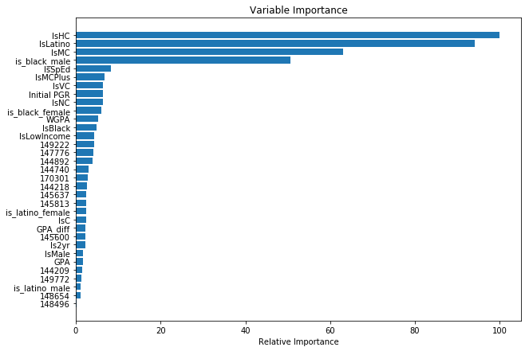

### Building a model to predict the college persistence of high school alumni

## File 4: Updated analysis
<i>Author:</i> Matt Niksch
<p><i>Synopsis</i>: Prior to the start of this project, an initial model has been built to predict which alumni of a high school network will persist in college. The purpose of this project is to reinvestigate that model and potentially augment it with free text responses from students using natural language processing.
<p>While the ultimate goal for the network is to have alumni persist through 4 years of college and earn bachelor's degrees, we estimate over 2/3 of students who leave college do so prior to the start of sophomore year. As such, the focus of this project is on predicting persistence to sophomore year. The College Success field uses two standard definitions to discuss these results:
* <b>Retention</b>: defined as being enrolled one year later at the initial college you began at as a first-time, full-time freshman; technically, a student could have retention if they skip the second semester of freshman year, but we'll use a stricter definition requiring continuous enrollment to the 3rd semester or 4th quarter
* <b>Persistence</b>: similar to retention but allows for transfers; students persist as long as they stay in a college, at any college

# This workbook attempts to beat the initial analysis
* First, we'll create a model that generates the predictions arrived at in the last file (File 3.)
* Second, we'll construct a few more dummy variables inside the original dataset
* Third, we'll use additional prediction techniques to try to beat the score of the current model

# (If you're just looking for the punchline, you can skip these next few sections and jump down to the next Markdown/narrative text)


```python
# First, we'll load the data in the same way as in the last workbook:
import pandas as pd
import numpy as np

from modules.predictions import Prediction
from create_coefficients import process_survey_file
%matplotlib inline
import matplotlib.pyplot as plt

LABEL = 'Retention3'

# First we need to load the data (see prior workbooks for details)
survey_data_file = 'inputs/Senior_Survey_Data.csv'
survey_key_file = 'inputs/Senior_Survey_Key.csv'
persistence_file = 'inputs/Persistence_Data.csv' # Has both persistence and retention

survey_df = process_survey_file(survey_data_file, survey_key_file)
main_df = pd.read_csv(persistence_file, encoding='cp1252', index_col=0)
main_df = pd.concat([main_df, survey_df], axis=1)
main_df.info()

#This combines the two main datafiles into a single frame
```

    <class 'pandas.core.frame.DataFrame'>
    Int64Index: 8345 entries, 20141948 to 50495984
    Data columns (total 59 columns):
    Id                                 8345 non-null object
    IsBlack                            8345 non-null int64
    IsLatino                           8345 non-null int64
    IsWhite                            8345 non-null int64
    IsAsian                            8345 non-null int64
    IsMinority                         8345 non-null int64
    IsLowIncome                        8184 non-null float64
    IsMale                             8345 non-null int64
    ACT                                8306 non-null float64
    GPA                                8345 non-null float64
    WGPA                               8345 non-null float64
    GPA_diff                           8345 non-null float64
    Class                              8345 non-null int64
    RandomSplit                        8345 non-null int64
    IsSpEd                             7995 non-null float64
    Campus                             8345 non-null object
    College attainment                 8345 non-null object
    Current Status                     8345 non-null object
    Initial PGR                        8345 non-null float64
    Initial IRR                        7197 non-null float64
    Initial NCES                       7267 non-null object
    IsMCPlus                           7267 non-null float64
    IsMC                               7267 non-null float64
    IsHC                               7267 non-null float64
    IsVC                               7267 non-null float64
    IsC                                7267 non-null float64
    IsNC                               7267 non-null float64
    Is2yr                              7267 non-null float64
    IsInitialHBCU                      7267 non-null float64
    Retention3                         5642 non-null float64
    Persistence3                       5642 non-null float64
    Retention5                         4278 non-null float64
    BA_in6                             699 non-null float64
    Retention semesters                8345 non-null int64
    BA completed in X Semesters        8345 non-null int64
    Initial College                    7295 non-null object
    Sem 2 College                      6915 non-null object
    Sem 3 College                      4723 non-null object
    Sem 4 College                      4496 non-null object
    Sem 5 College                      3098 non-null object
    Sem 6 College                      2976 non-null object
    Sem 7 College                      1921 non-null object
    Sem 8 College                      1878 non-null object
    Sem 9 College                      764 non-null object
    Sem 10 College                     692 non-null object
    Sem 11 College                     332 non-null object
    Sem 12 College                     296 non-null object
    HS_Class                           2776 non-null float64
    Self_Concept                       2774 non-null float64
    Growth_Mindset_Self_Efficacy       2749 non-null float64
    Performance_Avoidance              2733 non-null float64
    Academic_Delay_of_Gratification    2723 non-null float64
    Support_Networks_Family            2772 non-null float64
    Support_Networks_School            2767 non-null float64
    Organization_Time_Management       2729 non-null float64
    Intrinsic_Motivation               2754 non-null float64
    HS_Preparation                     2690 non-null float64
    Self_Regulation                    2734 non-null float64
    Academic_Identity                  2753 non-null float64
    dtypes: float64(32), int64(10), object(17)
    memory usage: 3.3+ MB
    


```python
# The coefficients we arrived at in the previous file were saved in a csv and loaded here:
initial_coef_df = pd.read_csv('initial_production_predicted_retention_model.csv', encoding='cp1252', index_col=0)
initial_coef_df = initial_coef_df[initial_coef_df['PredType']==LABEL]
pd.set_option('display.max_columns',20)
print(initial_coef_df)
```

                             GPA  Initial PGR   IsBlack  IsLatino    IsMale  \
    Case                                                                      
    145600              1.432396     0.000000  0.789797  0.296074 -0.103391   
    145637              2.660770     0.000000 -0.453124 -0.029381 -1.069278   
    149772              1.389676     0.000000 -0.042313 -0.174671 -0.363486   
    144209              0.952482     0.000000 -0.949206 -0.266709 -0.181737   
    145813              2.656760     0.000000 -0.693397 -1.260427  0.154174   
    147776              1.531583     0.000000  0.224399 -0.966275 -0.526516   
    144218              0.757737     0.000000  0.702307  0.260718 -0.091211   
    170301              2.282766     0.000000 -1.765478 -2.259145 -0.003059   
    149222              1.621314     0.000000 -1.701137 -1.759608 -0.098697   
    148654              1.435118     0.000000 -0.654680 -0.533624  0.252142   
    144892              1.056387     0.000000 -0.632106 -1.381500  0.141096   
    144740              2.795566     0.000000  0.591948  0.997595  1.017700   
    148496              0.884709     0.000000 -0.797946 -0.402245 -0.155475   
    Most Competitive+   2.886866   -26.352961 -8.675155 -7.877891  0.298800   
    Most Competitive    1.275806     9.487803  2.539446  1.063617 -0.328295   
    Highly Competitive  2.005915     2.193202 -0.993004 -1.378553  0.152740   
    Very Competitive    1.066840     2.242487  0.424220 -0.169301  0.086801   
    Competitive         1.258319     1.262513  0.365796  0.472322 -0.432028   
    Noncompetitive      0.500653     1.465643 -0.185319 -0.431555 -0.140336   
    2 year              0.736775     1.876851 -0.571861  0.389316 -0.688359   
    
                        intercept    PredType  
    Case                                       
    145600              -4.241788  Retention3  
    145637              -6.921431  Retention3  
    149772              -3.545637  Retention3  
    144209              -1.621256  Retention3  
    145813              -6.983732  Retention3  
    147776              -2.828627  Retention3  
    144218              -2.136070  Retention3  
    170301              -4.024622  Retention3  
    149222              -3.460745  Retention3  
    148654              -2.820555  Retention3  
    144892              -2.013606  Retention3  
    144740              -9.035173  Retention3  
    148496              -2.174220  Retention3  
    Most Competitive+   23.875079  Retention3  
    Most Competitive   -11.907583  Retention3  
    Highly Competitive  -5.632780  Retention3  
    Very Competitive    -4.033481  Retention3  
    Competitive         -4.031828  Retention3  
    Noncompetitive      -0.955243  Retention3  
    2 year              -2.307463  Retention3  
    


```python
# Now we'll define a function for using these coefficients for creating a 0 to 1 probability score using this model
def make_initial_score(x, coef_df):
    nces, ismcp, ismc, ishc, isvc, isc, isnc, is2yr, gpa, gr, isblack, islatino, ismale = x
    if nces in coef_df.index:
        case = nces
    elif ismcp:
        case = 'Most Competitive+'
    elif ismc:
        case = 'Most Competitive'
    elif ishc:
        case = 'Highly Competitive'
    elif isvc:
        case = 'Very Competitive'
    elif isc:
        case = 'Competitive'
    elif isnc:
        case = 'Noncompetitive'
    elif is2yr:
        case = '2 year'
    coefs = coef_df.loc[case]
    logit = (coefs['GPA']*gpa+
             coefs['Initial PGR']*gr+
             coefs['IsBlack']*isblack+
             coefs['IsLatino']*islatino+
             coefs['IsMale']*ismale+
             coefs['intercept'])
    return np.exp(logit)/(1+np.exp(logit))
```


```python
# Reduce the master data to the 2013-2015 data used earlier
df = main_df.loc[main_df['Class'].isin([2013, 2014, 2015])]
df = df.loc[df[LABEL].isin([0,1])] # We only want students who started college right away
print(df['Class'].value_counts().sort_index(0)) # total number of records across all grades
```

    2013    1122
    2014    1321
    2015    1364
    Name: Class, dtype: int64
    


```python
# Now apply the function to the master data
initial_case_inputs = ['Initial NCES', 'IsMCPlus', 'IsMC', 'IsHC', 'IsVC', 'IsC', 'IsNC', 'Is2yr']
initial_model_inputs = ['GPA', 'Initial PGR', 'IsBlack', 'IsLatino', 'IsMale']
initial_inputs = initial_case_inputs + initial_model_inputs
df['initial_odds_prediction'] = df[initial_inputs].apply(make_initial_score, axis=1, args=(initial_coef_df,))
df['initial_prediction'] = df['initial_odds_prediction'].apply(lambda x: 1 if x >=0.5 else 0)

```


```python
#A few quick stats:
print(df[['initial_odds_prediction','initial_prediction']].head())
print('Average prediction: {}'.format(np.mean(df['initial_odds_prediction'])))

```

              initial_odds_prediction  initial_prediction
    SID                                                  
    25637623                 0.478960                   0
    26108748                 0.378759                   0
    37778338                 0.747208                   1
    38441817                 0.679052                   1
    38741349                 0.252873                   0
    Average prediction: 0.6090658474249983
    


```python
# Now, let's define a function for scoring predictions
def assess_prediction(df, y, prediction):
    print('Average prediction: {}'.format(np.mean(df[prediction])))
    score = ((df[prediction]>=0.5) & (df[y]==1)) | ((df[prediction]<0.5) & (df[y]==0))
    error_rate = ((df[prediction]>=0.5) & (df[y]==0)) | ((df[prediction]<0.5) & (df[y]==1))
    print('Overall score: {:.0%}'.format(sum(score)/len(score)))
    print('Score by decile of prediction:\n   range,   n, prediction average, average outcome, score, avg error):')
    for i in range(10):
        lim = [i*0.1, 0.1+i*0.1]
        d_slice_df = df[(df[prediction]>=lim[0]) & (df[prediction]<lim[1])]
        slice_score = ((d_slice_df[prediction]>=0.5) & (d_slice_df[y]==1)) | ((d_slice_df[prediction]<0.5) & (d_slice_df[y]==0))
        print('{:3.0%}-{:4.0%}, {:3d}, {:18.1%}, {:15.1%}, {:5.0%}, {:7.1%}'.format(
            lim[0],lim[1],len(d_slice_df),
            d_slice_df[prediction].mean(),
            d_slice_df[y].mean(),
            sum(slice_score)/len(slice_score),
            d_slice_df[prediction].mean()-d_slice_df[y].mean()))

```

## Now that we've performed this setup, we can look at the performance of the baseline model developed in the last section


```python
assess_prediction(df[df['Class']==2015], LABEL, 'initial_odds_prediction') # we're using 2015 as the test here
```

    Average prediction: 0.6200463316983996
    Overall score: 71%
    Score by decile of prediction:
       range,   n, prediction average, average outcome, score, avg error):
     0%- 10%,   2,               7.9%,           50.0%,   50%,  -42.1%
    10%- 20%,  25,              16.1%,           16.0%,   84%,    0.1%
    20%- 30%,  58,              25.5%,           27.6%,   72%,   -2.0%
    30%- 40%,  98,              35.4%,           35.7%,   64%,   -0.3%
    40%- 50%, 163,              45.3%,           40.5%,   60%,    4.8%
    50%- 60%, 277,              55.4%,           57.0%,   57%,   -1.7%
    60%- 70%, 276,              64.7%,           65.6%,   66%,   -0.8%
    70%- 80%, 193,              74.5%,           80.8%,   81%,   -6.4%
    80%- 90%, 156,              85.2%,           87.8%,   88%,   -2.7%
    90%-100%, 116,              94.4%,           97.4%,   97%,   -3.0%
    

# Now we have a baseline that we'll seek to beat with different models
* Overall score of 71%
* Within each decile of prediction, the average outcome is very closely aligned (tupically within 2-3% with worst performance in the 40-50% and 70-80% bands at 5-6%)

## One step for the new trial predictions will be to construct a few additional features related to the intersection of race & gender along with dummy variables for the big colleges used in the current model


```python
df['is_black_male'] = (df['IsBlack']) & (df['IsMale'])
df['is_black_female'] = (df['IsBlack']) & (df['IsMale'] == 0)
df['is_latino_male'] = (df['IsLatino']) & (df['IsMale'])
df['is_latino_female'] = (df['IsLatino']) & (df['IsMale'] == 0)
special_colleges = initial_coef_df.index[:13] # should be 13
for special_college in special_colleges:
    df[special_college] = df['Initial NCES'].apply(lambda x: 1 if x == special_college else 0)

```

# Now, let's try the first alternative model: gradient boost


```python
# First, let's be clear on what our potential features are:
new_race_gender_fields = ['is_black_male', 'is_black_female', 'is_latino_male', 'is_latino_female']
additional_fields = ['WGPA', 'GPA_diff', 'IsSpEd', 'IsLowIncome']
X = initial_model_inputs + initial_case_inputs[1:]+new_race_gender_fields+additional_fields+list(special_colleges)
print(X)
df_train = df.loc[df['Class'].isin([2013, 2014])]
#df_test = df[df['Class']==2015]
X_train = df_train[X]
y_train = df_train[LABEL]
X_test = df[X]
```

    ['GPA', 'Initial PGR', 'IsBlack', 'IsLatino', 'IsMale', 'IsMCPlus', 'IsMC', 'IsHC', 'IsVC', 'IsC', 'IsNC', 'Is2yr', 'is_black_male', 'is_black_female', 'is_latino_male', 'is_latino_female', 'WGPA', 'GPA_diff', 'IsSpEd', 'IsLowIncome', '145600', '145637', '149772', '144209', '145813', '147776', '144218', '170301', '149222', '148654', '144892', '144740', '148496']
    


```python
from sklearn import ensemble
clf = ensemble.GradientBoostingRegressor()
clf.fit(X_train, y_train)
```


    GradientBoostingRegressor(alpha=0.9, criterion='friedman_mse', init=None,
                 learning_rate=0.1, loss='ls', max_depth=3, max_features=None,
                 max_leaf_nodes=None, min_impurity_decrease=0.0,
                 min_impurity_split=None, min_samples_leaf=1,
                 min_samples_split=2, min_weight_fraction_leaf=0.0,
                 n_estimators=100, presort='auto', random_state=None,
                 subsample=1.0, verbose=0, warm_start=False)


## Now that we've got a fit for GradientBoost, let's compare the result to that for the baseline model


```python
df['GradientPrediction'] = clf.predict(X_test)
assess_prediction(df[df['Class']==2015], LABEL, 'GradientPrediction') # we're using 2015 as the test here
```

    Average prediction: 0.6082632182257124
    Overall score: 67%
    Score by decile of prediction:
       range,   n, prediction average, average outcome, score, avg error):
     0%- 10%,   6,               6.4%,           33.3%,   67%,  -26.9%
    10%- 20%,  13,              16.5%,           30.8%,   69%,  -14.3%
    20%- 30%,  28,              26.9%,           39.3%,   61%,  -12.4%
    30%- 40%, 115,              35.9%,           35.7%,   64%,    0.2%
    40%- 50%, 217,              44.8%,           48.4%,   52%,   -3.6%
    50%- 60%, 273,              55.5%,           56.8%,   57%,   -1.2%
    60%- 70%, 292,              64.9%,           67.1%,   67%,   -2.2%
    70%- 80%, 226,              75.3%,           77.9%,   78%,   -2.6%
    80%- 90%, 119,              83.4%,           86.6%,   87%,   -3.2%
    90%-100%,  71,              93.8%,           98.6%,   99%,   -4.8%
    


```python
# Plot feature importance
def plot_feature_importance(clf, X):
    feature_importance = clf.feature_importances_
    # make importances relative to max importance
    feature_importance = 100.0 * (feature_importance / feature_importance.max())
    sorted_idx = np.argsort(feature_importance)
    pos = np.arange(sorted_idx.shape[0]) + .5
    plt.rcParams['figure.figsize'] = [10.0, 7.0]
    plt.barh(pos, feature_importance[sorted_idx], align='center')
    tickers = [x for _,x in sorted(zip(sorted_idx,X))]
    plt.yticks(pos, tickers)
    plt.xlabel('Relative Importance')
    plt.title('Variable Importance')
    plt.show()
plot_feature_importance(clf, X)
```


## Overall, the score is slightly worse than baseline. The above looks a little weird, though, so we'll try the same approach without the special colleges


```python
X = initial_model_inputs + initial_case_inputs[1:]+new_race_gender_fields+additional_fields
print(X)
df_train = df.loc[df['Class'].isin([2013, 2014])]
X_train = df_train[X]
y_train = df_train[LABEL]
X_test = df[X]
```

    ['GPA', 'Initial PGR', 'IsBlack', 'IsLatino', 'IsMale', 'IsMCPlus', 'IsMC', 'IsHC', 'IsVC', 'IsC', 'IsNC', 'Is2yr', 'is_black_male', 'is_black_female', 'is_latino_male', 'is_latino_female', 'WGPA', 'GPA_diff', 'IsSpEd', 'IsLowIncome']
    


```python
clf.fit(X_train, y_train)
df['GradientPredictionSimpler'] = clf.predict(X_test)
assess_prediction(df[df['Class']==2015], LABEL, 'GradientPredictionSimpler') # we're using 2015 as the test here
```

    Average prediction: 0.6055648661900214
    Overall score: 69%
    Score by decile of prediction:
       range,   n, prediction average, average outcome, score, avg error):
     0%- 10%,   2,               9.2%,           50.0%,   50%,  -40.8%
    10%- 20%,   5,              14.7%,           40.0%,   60%,  -25.3%
    20%- 30%,  28,              25.4%,           35.7%,   64%,  -10.3%
    30%- 40%, 128,              36.3%,           32.8%,   67%,    3.5%
    40%- 50%, 233,              45.2%,           45.5%,   55%,   -0.3%
    50%- 60%, 296,              55.3%,           57.4%,   57%,   -2.1%
    60%- 70%, 264,              64.9%,           69.7%,   70%,   -4.8%
    70%- 80%, 219,              75.2%,           82.2%,   82%,   -7.0%
    80%- 90%, 113,              83.8%,           85.8%,   86%,   -2.0%
    90%-100%,  72,              94.1%,           98.6%,   99%,   -4.5%
    


```python
plot_feature_importance(clf, X)
```


## Overall, this still doesn't yield higher results than the baseline

# Now let's try Random Forest


```python
X = initial_model_inputs + initial_case_inputs[1:]+new_race_gender_fields+additional_fields+list(special_colleges)
print(X)
df_train = df.loc[df['Class'].isin([2013, 2014])]
X_train = df_train[X]
y_train = df_train[LABEL]
X_test = df[X]
clf = ensemble.RandomForestRegressor()
clf.fit(X_train, y_train)
```

    ['GPA', 'Initial PGR', 'IsBlack', 'IsLatino', 'IsMale', 'IsMCPlus', 'IsMC', 'IsHC', 'IsVC', 'IsC', 'IsNC', 'Is2yr', 'is_black_male', 'is_black_female', 'is_latino_male', 'is_latino_female', 'WGPA', 'GPA_diff', 'IsSpEd', 'IsLowIncome', '145600', '145637', '149772', '144209', '145813', '147776', '144218', '170301', '149222', '148654', '144892', '144740', '148496']
    


    RandomForestRegressor(bootstrap=True, criterion='mse', max_depth=None,
               max_features='auto', max_leaf_nodes=None,
               min_impurity_decrease=0.0, min_impurity_split=None,
               min_samples_leaf=1, min_samples_split=2,
               min_weight_fraction_leaf=0.0, n_estimators=10, n_jobs=1,
               oob_score=False, random_state=None, verbose=0, warm_start=False)


```python
df['RandomForestPrediction'] = clf.predict(X_test)
assess_prediction(df[df['Class']==2015], LABEL, 'RandomForestPrediction') # we're using 2015 as the test here
plot_feature_importance(clf, X)
```

    Average prediction: 0.607441348973607
    Overall score: 64%
    Score by decile of prediction:
       range,   n, prediction average, average outcome, score, avg error):
     0%- 10%,  20,               0.0%,           35.0%,   65%,  -35.0%
    10%- 20%,  45,              10.3%,           46.7%,   53%,  -36.4%
    20%- 30%, 196,              25.9%,           49.5%,   51%,  -23.6%
    30%- 40%,   3,              34.4%,           33.3%,   67%,    1.1%
    40%- 50%, 126,              40.0%,           50.8%,   49%,  -10.8%
    50%- 60%, 160,              50.0%,           58.1%,   58%,   -8.1%
    60%- 70%, 177,              69.9%,           62.7%,   63%,    7.2%
    70%- 80%,   1,              73.3%,          100.0%,  100%,  -26.7%
    80%- 90%, 159,              80.0%,           75.5%,   75%,    4.5%
    90%-100%, 143,              90.1%,           81.8%,   82%,    8.3%
    





# In summary, maybe the baseline wins out?

## A few more reflections:
* The baseline model isn't a "pure" model in the sense that it's constructed by piecing together as series of L2 Regularized Logistic Regressions that were run on what were assumed to be important cases (e.g. specific colleges and college classes like "Highly Competitive", "Very Competitive", etc.) These were assumed as important cases based on expert experience in working with colleges, not from machine learning
* The above trials with Random Forest and Gradient Boost seem to confirm those assumptions in general. The college specific terms used to "slice" the prediction in the baseline tend to show strongly in the relative importance analyses graphed above
* <b>I will keep the structure of the baseline model for production.</b> It appears to be a better fit than the above two models. Additionally, because I'm employing a strategy of slicing the data into these relatively small cases, I'd prefer not to try to fit to too many data points. Variables known to be fundamentally important like GPA, college grad rate, gender, and race are "safer" with smaller data sets.
* That said, I will plan to conduct further trials within that structure around the specific variable choices within those categories:
1) While I ran trials in my initial analysis with both weighted and unweighted GPA and picked the latter over score, the graphs above suggest WGPA might have been a better fit. A created feature for class rank might also be useful in that. 2) I picked simple dummy variables for race and gender, but the above also suggests "is_black_male" and "is_latino_female" might have more predictive power.
* I made the initial model choices primarily based on simple score, but the breakdown by decile shown above is a useful and I think better way to consider model fit
